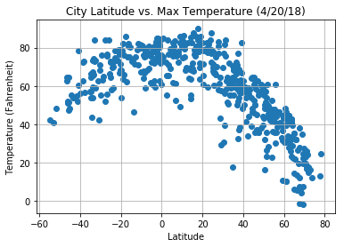
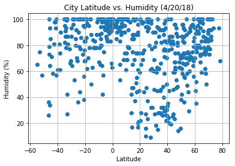
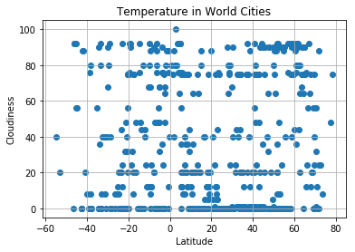
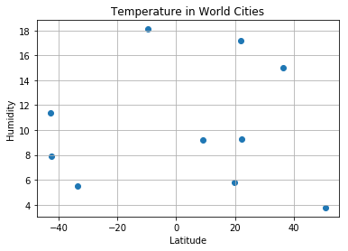

## Unit 6 | Assignment - What's the Weather Like?
* There is a clear connection between Temperature and Latitude
* There is no connection between cloud cover and the latitude
* There is no connection between wind speed and the latitude


```python
import random
import json
import requests
import pandas as pd
import matplotlib.pyplot as plt

from citipy import citipy

#import api_key
from config import api_key
```


```python
# make the API call using owm's get_fourcast_hourly method
url = "http://api.openweathermap.org/data/2.5/weather?"
units = "imperial"
temp = []
lat = []
hum = []
cloud = []
wind = []

cities = set()
#rand_numbers_lol = {}

number_of_cities = 501
#rand_lat = {}
#rand_lon = {}
count = 0
#random.uniform(-90,90), random.uniform(-180,180)
```


```python
query_url = f"{url}appid={api_key}&units={units}&q="
while (len(set(cities)) < number_of_cities):
    city = citipy.nearest_city(random.uniform(-90,90), random.uniform(-180,180))
    response = requests.get(query_url + city.city_name).json()
    if response['cod'] == '404':
        #print('Not Found')
        continue
    else:
        prev_number_of_cities = len(cities)
        cities.add(city.city_name)
        if prev_number_of_cities != len(cities):
            temp.append(response['main']['temp'])
            lat.append(response['coord']['lat'])
            hum.append(response['main']['humidity'])
            cloud.append(response['clouds']['all'])
            wind.append(response['wind']['speed'])
            print(f'-----------------------------\nProcessing Record {len(set(cities))} of Set {number_of_cities} | {city.city_name} {query_url + city.city_name}'
            )

```

    -----------------------------
    Processing Record 1 of Set 501 | busselton http://api.openweathermap.org/data/2.5/weather?appid=ff31044259f1be250728e2f69466884d&units=imperial&q=busselton
    -----------------------------
    Processing Record 2 of Set 501 | sechura http://api.openweathermap.org/data/2.5/weather?appid=ff31044259f1be250728e2f69466884d&units=imperial&q=sechura
    -----------------------------
    Processing Record 3 of Set 501 | cape town http://api.openweathermap.org/data/2.5/weather?appid=ff31044259f1be250728e2f69466884d&units=imperial&q=cape town
    -----------------------------
    Processing Record 4 of Set 501 | ushuaia http://api.openweathermap.org/data/2.5/weather?appid=ff31044259f1be250728e2f69466884d&units=imperial&q=ushuaia
    -----------------------------
    Processing Record 5 of Set 501 | harper http://api.openweathermap.org/data/2.5/weather?appid=ff31044259f1be250728e2f69466884d&units=imperial&q=harper
    -----------------------------
    Processing Record 6 of Set 501 | arraial do cabo http://api.openweathermap.org/data/2.5/weather?appid=ff31044259f1be250728e2f69466884d&units=imperial&q=arraial do cabo
    -----------------------------
    Processing Record 7 of Set 501 | tiksi http://api.openweathermap.org/data/2.5/weather?appid=ff31044259f1be250728e2f69466884d&units=imperial&q=tiksi
    -----------------------------
    Processing Record 8 of Set 501 | kennett http://api.openweathermap.org/data/2.5/weather?appid=ff31044259f1be250728e2f69466884d&units=imperial&q=kennett
    -----------------------------
    Processing Record 9 of Set 501 | alofi http://api.openweathermap.org/data/2.5/weather?appid=ff31044259f1be250728e2f69466884d&units=imperial&q=alofi
    -----------------------------
    Processing Record 10 of Set 501 | poya http://api.openweathermap.org/data/2.5/weather?appid=ff31044259f1be250728e2f69466884d&units=imperial&q=poya
    -----------------------------
    Processing Record 11 of Set 501 | rikitea http://api.openweathermap.org/data/2.5/weather?appid=ff31044259f1be250728e2f69466884d&units=imperial&q=rikitea
    -----------------------------
    Processing Record 12 of Set 501 | butaritari http://api.openweathermap.org/data/2.5/weather?appid=ff31044259f1be250728e2f69466884d&units=imperial&q=butaritari
    -----------------------------
    Processing Record 13 of Set 501 | bethel http://api.openweathermap.org/data/2.5/weather?appid=ff31044259f1be250728e2f69466884d&units=imperial&q=bethel
    -----------------------------
    Processing Record 14 of Set 501 | krapivinskiy http://api.openweathermap.org/data/2.5/weather?appid=ff31044259f1be250728e2f69466884d&units=imperial&q=krapivinskiy
    -----------------------------
    Processing Record 15 of Set 501 | cambridge http://api.openweathermap.org/data/2.5/weather?appid=ff31044259f1be250728e2f69466884d&units=imperial&q=cambridge
    -----------------------------
    Processing Record 16 of Set 501 | bubaque http://api.openweathermap.org/data/2.5/weather?appid=ff31044259f1be250728e2f69466884d&units=imperial&q=bubaque
    -----------------------------
    Processing Record 17 of Set 501 | bredasdorp http://api.openweathermap.org/data/2.5/weather?appid=ff31044259f1be250728e2f69466884d&units=imperial&q=bredasdorp
    -----------------------------
    Processing Record 18 of Set 501 | qaanaaq http://api.openweathermap.org/data/2.5/weather?appid=ff31044259f1be250728e2f69466884d&units=imperial&q=qaanaaq
    -----------------------------
    Processing Record 19 of Set 501 | mataura http://api.openweathermap.org/data/2.5/weather?appid=ff31044259f1be250728e2f69466884d&units=imperial&q=mataura
    -----------------------------
    Processing Record 20 of Set 501 | yellowknife http://api.openweathermap.org/data/2.5/weather?appid=ff31044259f1be250728e2f69466884d&units=imperial&q=yellowknife
    -----------------------------
    Processing Record 21 of Set 501 | hermanus http://api.openweathermap.org/data/2.5/weather?appid=ff31044259f1be250728e2f69466884d&units=imperial&q=hermanus
    -----------------------------
    Processing Record 22 of Set 501 | ancud http://api.openweathermap.org/data/2.5/weather?appid=ff31044259f1be250728e2f69466884d&units=imperial&q=ancud
    -----------------------------
    Processing Record 23 of Set 501 | hasaki http://api.openweathermap.org/data/2.5/weather?appid=ff31044259f1be250728e2f69466884d&units=imperial&q=hasaki
    -----------------------------
    Processing Record 24 of Set 501 | san juan del sur http://api.openweathermap.org/data/2.5/weather?appid=ff31044259f1be250728e2f69466884d&units=imperial&q=san juan del sur
    -----------------------------
    Processing Record 25 of Set 501 | cabo san lucas http://api.openweathermap.org/data/2.5/weather?appid=ff31044259f1be250728e2f69466884d&units=imperial&q=cabo san lucas
    -----------------------------
    Processing Record 26 of Set 501 | russell http://api.openweathermap.org/data/2.5/weather?appid=ff31044259f1be250728e2f69466884d&units=imperial&q=russell
    -----------------------------
    Processing Record 27 of Set 501 | payo http://api.openweathermap.org/data/2.5/weather?appid=ff31044259f1be250728e2f69466884d&units=imperial&q=payo
    -----------------------------
    Processing Record 28 of Set 501 | qaqortoq http://api.openweathermap.org/data/2.5/weather?appid=ff31044259f1be250728e2f69466884d&units=imperial&q=qaqortoq
    -----------------------------
    Processing Record 29 of Set 501 | albany http://api.openweathermap.org/data/2.5/weather?appid=ff31044259f1be250728e2f69466884d&units=imperial&q=albany
    -----------------------------
    Processing Record 30 of Set 501 | kapaa http://api.openweathermap.org/data/2.5/weather?appid=ff31044259f1be250728e2f69466884d&units=imperial&q=kapaa
    -----------------------------
    Processing Record 31 of Set 501 | ternate http://api.openweathermap.org/data/2.5/weather?appid=ff31044259f1be250728e2f69466884d&units=imperial&q=ternate
    -----------------------------
    Processing Record 32 of Set 501 | souillac http://api.openweathermap.org/data/2.5/weather?appid=ff31044259f1be250728e2f69466884d&units=imperial&q=souillac
    -----------------------------
    Processing Record 33 of Set 501 | codrington http://api.openweathermap.org/data/2.5/weather?appid=ff31044259f1be250728e2f69466884d&units=imperial&q=codrington
    -----------------------------
    Processing Record 34 of Set 501 | saint george http://api.openweathermap.org/data/2.5/weather?appid=ff31044259f1be250728e2f69466884d&units=imperial&q=saint george
    -----------------------------
    Processing Record 35 of Set 501 | atuona http://api.openweathermap.org/data/2.5/weather?appid=ff31044259f1be250728e2f69466884d&units=imperial&q=atuona
    -----------------------------
    Processing Record 36 of Set 501 | punta arenas http://api.openweathermap.org/data/2.5/weather?appid=ff31044259f1be250728e2f69466884d&units=imperial&q=punta arenas
    -----------------------------
    Processing Record 37 of Set 501 | grindavik http://api.openweathermap.org/data/2.5/weather?appid=ff31044259f1be250728e2f69466884d&units=imperial&q=grindavik
    -----------------------------
    Processing Record 38 of Set 501 | hobart http://api.openweathermap.org/data/2.5/weather?appid=ff31044259f1be250728e2f69466884d&units=imperial&q=hobart
    -----------------------------
    Processing Record 39 of Set 501 | palmer http://api.openweathermap.org/data/2.5/weather?appid=ff31044259f1be250728e2f69466884d&units=imperial&q=palmer
    -----------------------------
    Processing Record 40 of Set 501 | awbari http://api.openweathermap.org/data/2.5/weather?appid=ff31044259f1be250728e2f69466884d&units=imperial&q=awbari
    -----------------------------
    Processing Record 41 of Set 501 | taksimo http://api.openweathermap.org/data/2.5/weather?appid=ff31044259f1be250728e2f69466884d&units=imperial&q=taksimo
    -----------------------------
    Processing Record 42 of Set 501 | georgetown http://api.openweathermap.org/data/2.5/weather?appid=ff31044259f1be250728e2f69466884d&units=imperial&q=georgetown
    -----------------------------
    Processing Record 43 of Set 501 | mehamn http://api.openweathermap.org/data/2.5/weather?appid=ff31044259f1be250728e2f69466884d&units=imperial&q=mehamn
    -----------------------------
    Processing Record 44 of Set 501 | paracuru http://api.openweathermap.org/data/2.5/weather?appid=ff31044259f1be250728e2f69466884d&units=imperial&q=paracuru
    -----------------------------
    Processing Record 45 of Set 501 | kodiak http://api.openweathermap.org/data/2.5/weather?appid=ff31044259f1be250728e2f69466884d&units=imperial&q=kodiak
    -----------------------------
    Processing Record 46 of Set 501 | cidreira http://api.openweathermap.org/data/2.5/weather?appid=ff31044259f1be250728e2f69466884d&units=imperial&q=cidreira
    -----------------------------
    Processing Record 47 of Set 501 | kalmunai http://api.openweathermap.org/data/2.5/weather?appid=ff31044259f1be250728e2f69466884d&units=imperial&q=kalmunai
    -----------------------------
    Processing Record 48 of Set 501 | isangel http://api.openweathermap.org/data/2.5/weather?appid=ff31044259f1be250728e2f69466884d&units=imperial&q=isangel
    -----------------------------
    Processing Record 49 of Set 501 | along http://api.openweathermap.org/data/2.5/weather?appid=ff31044259f1be250728e2f69466884d&units=imperial&q=along
    -----------------------------
    Processing Record 50 of Set 501 | hami http://api.openweathermap.org/data/2.5/weather?appid=ff31044259f1be250728e2f69466884d&units=imperial&q=hami
    -----------------------------
    Processing Record 51 of Set 501 | nikolskoye http://api.openweathermap.org/data/2.5/weather?appid=ff31044259f1be250728e2f69466884d&units=imperial&q=nikolskoye
    -----------------------------
    Processing Record 52 of Set 501 | puerto ayora http://api.openweathermap.org/data/2.5/weather?appid=ff31044259f1be250728e2f69466884d&units=imperial&q=puerto ayora
    -----------------------------
    Processing Record 53 of Set 501 | saskylakh http://api.openweathermap.org/data/2.5/weather?appid=ff31044259f1be250728e2f69466884d&units=imperial&q=saskylakh
    -----------------------------
    Processing Record 54 of Set 501 | avarua http://api.openweathermap.org/data/2.5/weather?appid=ff31044259f1be250728e2f69466884d&units=imperial&q=avarua
    -----------------------------
    Processing Record 55 of Set 501 | mar del plata http://api.openweathermap.org/data/2.5/weather?appid=ff31044259f1be250728e2f69466884d&units=imperial&q=mar del plata
    -----------------------------
    Processing Record 56 of Set 501 | mega http://api.openweathermap.org/data/2.5/weather?appid=ff31044259f1be250728e2f69466884d&units=imperial&q=mega
    -----------------------------
    Processing Record 57 of Set 501 | los llanos de aridane http://api.openweathermap.org/data/2.5/weather?appid=ff31044259f1be250728e2f69466884d&units=imperial&q=los llanos de aridane
    -----------------------------
    Processing Record 58 of Set 501 | novobirilyussy http://api.openweathermap.org/data/2.5/weather?appid=ff31044259f1be250728e2f69466884d&units=imperial&q=novobirilyussy
    -----------------------------
    Processing Record 59 of Set 501 | brae http://api.openweathermap.org/data/2.5/weather?appid=ff31044259f1be250728e2f69466884d&units=imperial&q=brae
    -----------------------------
    Processing Record 60 of Set 501 | avera http://api.openweathermap.org/data/2.5/weather?appid=ff31044259f1be250728e2f69466884d&units=imperial&q=avera
    -----------------------------
    Processing Record 61 of Set 501 | thompson http://api.openweathermap.org/data/2.5/weather?appid=ff31044259f1be250728e2f69466884d&units=imperial&q=thompson
    -----------------------------
    Processing Record 62 of Set 501 | takoradi http://api.openweathermap.org/data/2.5/weather?appid=ff31044259f1be250728e2f69466884d&units=imperial&q=takoradi
    -----------------------------
    Processing Record 63 of Set 501 | severo-kurilsk http://api.openweathermap.org/data/2.5/weather?appid=ff31044259f1be250728e2f69466884d&units=imperial&q=severo-kurilsk
    -----------------------------
    Processing Record 64 of Set 501 | mahebourg http://api.openweathermap.org/data/2.5/weather?appid=ff31044259f1be250728e2f69466884d&units=imperial&q=mahebourg
    -----------------------------
    Processing Record 65 of Set 501 | sorland http://api.openweathermap.org/data/2.5/weather?appid=ff31044259f1be250728e2f69466884d&units=imperial&q=sorland
    -----------------------------
    Processing Record 66 of Set 501 | oistins http://api.openweathermap.org/data/2.5/weather?appid=ff31044259f1be250728e2f69466884d&units=imperial&q=oistins
    -----------------------------
    Processing Record 67 of Set 501 | bluff http://api.openweathermap.org/data/2.5/weather?appid=ff31044259f1be250728e2f69466884d&units=imperial&q=bluff
    -----------------------------
    Processing Record 68 of Set 501 | chokurdakh http://api.openweathermap.org/data/2.5/weather?appid=ff31044259f1be250728e2f69466884d&units=imperial&q=chokurdakh
    -----------------------------
    Processing Record 69 of Set 501 | hithadhoo http://api.openweathermap.org/data/2.5/weather?appid=ff31044259f1be250728e2f69466884d&units=imperial&q=hithadhoo
    -----------------------------
    Processing Record 70 of Set 501 | corbelia http://api.openweathermap.org/data/2.5/weather?appid=ff31044259f1be250728e2f69466884d&units=imperial&q=corbelia
    -----------------------------
    Processing Record 71 of Set 501 | cabedelo http://api.openweathermap.org/data/2.5/weather?appid=ff31044259f1be250728e2f69466884d&units=imperial&q=cabedelo
    -----------------------------
    Processing Record 72 of Set 501 | barrow http://api.openweathermap.org/data/2.5/weather?appid=ff31044259f1be250728e2f69466884d&units=imperial&q=barrow
    -----------------------------
    Processing Record 73 of Set 501 | kaeo http://api.openweathermap.org/data/2.5/weather?appid=ff31044259f1be250728e2f69466884d&units=imperial&q=kaeo
    -----------------------------
    Processing Record 74 of Set 501 | tasiilaq http://api.openweathermap.org/data/2.5/weather?appid=ff31044259f1be250728e2f69466884d&units=imperial&q=tasiilaq
    -----------------------------
    Processing Record 75 of Set 501 | lebu http://api.openweathermap.org/data/2.5/weather?appid=ff31044259f1be250728e2f69466884d&units=imperial&q=lebu
    -----------------------------
    Processing Record 76 of Set 501 | nantucket http://api.openweathermap.org/data/2.5/weather?appid=ff31044259f1be250728e2f69466884d&units=imperial&q=nantucket
    -----------------------------
    Processing Record 77 of Set 501 | fenoarivo http://api.openweathermap.org/data/2.5/weather?appid=ff31044259f1be250728e2f69466884d&units=imperial&q=fenoarivo
    -----------------------------
    Processing Record 78 of Set 501 | loei http://api.openweathermap.org/data/2.5/weather?appid=ff31044259f1be250728e2f69466884d&units=imperial&q=loei
    -----------------------------
    Processing Record 79 of Set 501 | mantua http://api.openweathermap.org/data/2.5/weather?appid=ff31044259f1be250728e2f69466884d&units=imperial&q=mantua
    -----------------------------
    Processing Record 80 of Set 501 | kulunda http://api.openweathermap.org/data/2.5/weather?appid=ff31044259f1be250728e2f69466884d&units=imperial&q=kulunda
    -----------------------------
    Processing Record 81 of Set 501 | quatre cocos http://api.openweathermap.org/data/2.5/weather?appid=ff31044259f1be250728e2f69466884d&units=imperial&q=quatre cocos
    -----------------------------
    Processing Record 82 of Set 501 | port alfred http://api.openweathermap.org/data/2.5/weather?appid=ff31044259f1be250728e2f69466884d&units=imperial&q=port alfred
    -----------------------------
    Processing Record 83 of Set 501 | chuy http://api.openweathermap.org/data/2.5/weather?appid=ff31044259f1be250728e2f69466884d&units=imperial&q=chuy
    -----------------------------
    Processing Record 84 of Set 501 | provideniya http://api.openweathermap.org/data/2.5/weather?appid=ff31044259f1be250728e2f69466884d&units=imperial&q=provideniya
    -----------------------------
    Processing Record 85 of Set 501 | dharchula http://api.openweathermap.org/data/2.5/weather?appid=ff31044259f1be250728e2f69466884d&units=imperial&q=dharchula
    -----------------------------
    Processing Record 86 of Set 501 | guerrero negro http://api.openweathermap.org/data/2.5/weather?appid=ff31044259f1be250728e2f69466884d&units=imperial&q=guerrero negro
    -----------------------------
    Processing Record 87 of Set 501 | vaini http://api.openweathermap.org/data/2.5/weather?appid=ff31044259f1be250728e2f69466884d&units=imperial&q=vaini
    -----------------------------
    Processing Record 88 of Set 501 | warrington http://api.openweathermap.org/data/2.5/weather?appid=ff31044259f1be250728e2f69466884d&units=imperial&q=warrington
    -----------------------------
    Processing Record 89 of Set 501 | zhangye http://api.openweathermap.org/data/2.5/weather?appid=ff31044259f1be250728e2f69466884d&units=imperial&q=zhangye
    -----------------------------
    Processing Record 90 of Set 501 | buraydah http://api.openweathermap.org/data/2.5/weather?appid=ff31044259f1be250728e2f69466884d&units=imperial&q=buraydah
    -----------------------------
    Processing Record 91 of Set 501 | fez http://api.openweathermap.org/data/2.5/weather?appid=ff31044259f1be250728e2f69466884d&units=imperial&q=fez
    -----------------------------
    Processing Record 92 of Set 501 | harbour breton http://api.openweathermap.org/data/2.5/weather?appid=ff31044259f1be250728e2f69466884d&units=imperial&q=harbour breton
    -----------------------------
    Processing Record 93 of Set 501 | iturama http://api.openweathermap.org/data/2.5/weather?appid=ff31044259f1be250728e2f69466884d&units=imperial&q=iturama
    -----------------------------
    Processing Record 94 of Set 501 | vila franca do campo http://api.openweathermap.org/data/2.5/weather?appid=ff31044259f1be250728e2f69466884d&units=imperial&q=vila franca do campo
    -----------------------------
    Processing Record 95 of Set 501 | jamestown http://api.openweathermap.org/data/2.5/weather?appid=ff31044259f1be250728e2f69466884d&units=imperial&q=jamestown
    -----------------------------
    Processing Record 96 of Set 501 | koumac http://api.openweathermap.org/data/2.5/weather?appid=ff31044259f1be250728e2f69466884d&units=imperial&q=koumac
    -----------------------------
    Processing Record 97 of Set 501 | berlevag http://api.openweathermap.org/data/2.5/weather?appid=ff31044259f1be250728e2f69466884d&units=imperial&q=berlevag
    -----------------------------
    Processing Record 98 of Set 501 | nelson bay http://api.openweathermap.org/data/2.5/weather?appid=ff31044259f1be250728e2f69466884d&units=imperial&q=nelson bay
    -----------------------------
    Processing Record 99 of Set 501 | pangai http://api.openweathermap.org/data/2.5/weather?appid=ff31044259f1be250728e2f69466884d&units=imperial&q=pangai
    -----------------------------
    Processing Record 100 of Set 501 | port hawkesbury http://api.openweathermap.org/data/2.5/weather?appid=ff31044259f1be250728e2f69466884d&units=imperial&q=port hawkesbury
    -----------------------------
    Processing Record 101 of Set 501 | clyde river http://api.openweathermap.org/data/2.5/weather?appid=ff31044259f1be250728e2f69466884d&units=imperial&q=clyde river
    -----------------------------
    Processing Record 102 of Set 501 | goderich http://api.openweathermap.org/data/2.5/weather?appid=ff31044259f1be250728e2f69466884d&units=imperial&q=goderich
    -----------------------------
    Processing Record 103 of Set 501 | leningradskiy http://api.openweathermap.org/data/2.5/weather?appid=ff31044259f1be250728e2f69466884d&units=imperial&q=leningradskiy
    -----------------------------
    Processing Record 104 of Set 501 | krasnyy chikoy http://api.openweathermap.org/data/2.5/weather?appid=ff31044259f1be250728e2f69466884d&units=imperial&q=krasnyy chikoy
    -----------------------------
    Processing Record 105 of Set 501 | torbay http://api.openweathermap.org/data/2.5/weather?appid=ff31044259f1be250728e2f69466884d&units=imperial&q=torbay
    -----------------------------
    Processing Record 106 of Set 501 | quelimane http://api.openweathermap.org/data/2.5/weather?appid=ff31044259f1be250728e2f69466884d&units=imperial&q=quelimane
    -----------------------------
    Processing Record 107 of Set 501 | svetlogorsk http://api.openweathermap.org/data/2.5/weather?appid=ff31044259f1be250728e2f69466884d&units=imperial&q=svetlogorsk
    -----------------------------
    Processing Record 108 of Set 501 | dekar http://api.openweathermap.org/data/2.5/weather?appid=ff31044259f1be250728e2f69466884d&units=imperial&q=dekar
    -----------------------------
    Processing Record 109 of Set 501 | antalaha http://api.openweathermap.org/data/2.5/weather?appid=ff31044259f1be250728e2f69466884d&units=imperial&q=antalaha
    -----------------------------
    Processing Record 110 of Set 501 | iquique http://api.openweathermap.org/data/2.5/weather?appid=ff31044259f1be250728e2f69466884d&units=imperial&q=iquique
    -----------------------------
    Processing Record 111 of Set 501 | fonte boa http://api.openweathermap.org/data/2.5/weather?appid=ff31044259f1be250728e2f69466884d&units=imperial&q=fonte boa
    -----------------------------
    Processing Record 112 of Set 501 | letka http://api.openweathermap.org/data/2.5/weather?appid=ff31044259f1be250728e2f69466884d&units=imperial&q=letka
    -----------------------------
    Processing Record 113 of Set 501 | lasa http://api.openweathermap.org/data/2.5/weather?appid=ff31044259f1be250728e2f69466884d&units=imperial&q=lasa
    -----------------------------
    Processing Record 114 of Set 501 | constitucion http://api.openweathermap.org/data/2.5/weather?appid=ff31044259f1be250728e2f69466884d&units=imperial&q=constitucion
    -----------------------------
    Processing Record 115 of Set 501 | sioux lookout http://api.openweathermap.org/data/2.5/weather?appid=ff31044259f1be250728e2f69466884d&units=imperial&q=sioux lookout
    -----------------------------
    Processing Record 116 of Set 501 | saint-philippe http://api.openweathermap.org/data/2.5/weather?appid=ff31044259f1be250728e2f69466884d&units=imperial&q=saint-philippe
    -----------------------------
    Processing Record 117 of Set 501 | katsuura http://api.openweathermap.org/data/2.5/weather?appid=ff31044259f1be250728e2f69466884d&units=imperial&q=katsuura
    -----------------------------
    Processing Record 118 of Set 501 | hobyo http://api.openweathermap.org/data/2.5/weather?appid=ff31044259f1be250728e2f69466884d&units=imperial&q=hobyo
    -----------------------------
    Processing Record 119 of Set 501 | that phanom http://api.openweathermap.org/data/2.5/weather?appid=ff31044259f1be250728e2f69466884d&units=imperial&q=that phanom
    -----------------------------
    Processing Record 120 of Set 501 | lorengau http://api.openweathermap.org/data/2.5/weather?appid=ff31044259f1be250728e2f69466884d&units=imperial&q=lorengau
    -----------------------------
    Processing Record 121 of Set 501 | fortuna http://api.openweathermap.org/data/2.5/weather?appid=ff31044259f1be250728e2f69466884d&units=imperial&q=fortuna
    -----------------------------
    Processing Record 122 of Set 501 | oranjemund http://api.openweathermap.org/data/2.5/weather?appid=ff31044259f1be250728e2f69466884d&units=imperial&q=oranjemund
    -----------------------------
    Processing Record 123 of Set 501 | erzin http://api.openweathermap.org/data/2.5/weather?appid=ff31044259f1be250728e2f69466884d&units=imperial&q=erzin
    -----------------------------
    Processing Record 124 of Set 501 | tshikapa http://api.openweathermap.org/data/2.5/weather?appid=ff31044259f1be250728e2f69466884d&units=imperial&q=tshikapa
    -----------------------------
    Processing Record 125 of Set 501 | birao http://api.openweathermap.org/data/2.5/weather?appid=ff31044259f1be250728e2f69466884d&units=imperial&q=birao
    -----------------------------
    Processing Record 126 of Set 501 | iqaluit http://api.openweathermap.org/data/2.5/weather?appid=ff31044259f1be250728e2f69466884d&units=imperial&q=iqaluit
    -----------------------------
    Processing Record 127 of Set 501 | malanje http://api.openweathermap.org/data/2.5/weather?appid=ff31044259f1be250728e2f69466884d&units=imperial&q=malanje
    -----------------------------
    Processing Record 128 of Set 501 | raxaul http://api.openweathermap.org/data/2.5/weather?appid=ff31044259f1be250728e2f69466884d&units=imperial&q=raxaul
    -----------------------------
    Processing Record 129 of Set 501 | miri http://api.openweathermap.org/data/2.5/weather?appid=ff31044259f1be250728e2f69466884d&units=imperial&q=miri
    -----------------------------
    Processing Record 130 of Set 501 | tamworth http://api.openweathermap.org/data/2.5/weather?appid=ff31044259f1be250728e2f69466884d&units=imperial&q=tamworth
    -----------------------------
    Processing Record 131 of Set 501 | verkhovazhye http://api.openweathermap.org/data/2.5/weather?appid=ff31044259f1be250728e2f69466884d&units=imperial&q=verkhovazhye
    -----------------------------
    Processing Record 132 of Set 501 | kupang http://api.openweathermap.org/data/2.5/weather?appid=ff31044259f1be250728e2f69466884d&units=imperial&q=kupang
    -----------------------------
    Processing Record 133 of Set 501 | manama http://api.openweathermap.org/data/2.5/weather?appid=ff31044259f1be250728e2f69466884d&units=imperial&q=manama
    -----------------------------
    Processing Record 134 of Set 501 | abapo http://api.openweathermap.org/data/2.5/weather?appid=ff31044259f1be250728e2f69466884d&units=imperial&q=abapo
    -----------------------------
    Processing Record 135 of Set 501 | estelle http://api.openweathermap.org/data/2.5/weather?appid=ff31044259f1be250728e2f69466884d&units=imperial&q=estelle
    -----------------------------
    Processing Record 136 of Set 501 | algiers http://api.openweathermap.org/data/2.5/weather?appid=ff31044259f1be250728e2f69466884d&units=imperial&q=algiers
    -----------------------------
    Processing Record 137 of Set 501 | kahului http://api.openweathermap.org/data/2.5/weather?appid=ff31044259f1be250728e2f69466884d&units=imperial&q=kahului
    -----------------------------
    Processing Record 138 of Set 501 | esperance http://api.openweathermap.org/data/2.5/weather?appid=ff31044259f1be250728e2f69466884d&units=imperial&q=esperance
    -----------------------------
    Processing Record 139 of Set 501 | mayo http://api.openweathermap.org/data/2.5/weather?appid=ff31044259f1be250728e2f69466884d&units=imperial&q=mayo
    -----------------------------
    Processing Record 140 of Set 501 | havelock http://api.openweathermap.org/data/2.5/weather?appid=ff31044259f1be250728e2f69466884d&units=imperial&q=havelock
    -----------------------------
    Processing Record 141 of Set 501 | inhambane http://api.openweathermap.org/data/2.5/weather?appid=ff31044259f1be250728e2f69466884d&units=imperial&q=inhambane
    -----------------------------
    Processing Record 142 of Set 501 | iquitos http://api.openweathermap.org/data/2.5/weather?appid=ff31044259f1be250728e2f69466884d&units=imperial&q=iquitos
    -----------------------------
    Processing Record 143 of Set 501 | victoria http://api.openweathermap.org/data/2.5/weather?appid=ff31044259f1be250728e2f69466884d&units=imperial&q=victoria
    -----------------------------
    Processing Record 144 of Set 501 | sao joao da barra http://api.openweathermap.org/data/2.5/weather?appid=ff31044259f1be250728e2f69466884d&units=imperial&q=sao joao da barra
    -----------------------------
    Processing Record 145 of Set 501 | zhuhai http://api.openweathermap.org/data/2.5/weather?appid=ff31044259f1be250728e2f69466884d&units=imperial&q=zhuhai
    -----------------------------
    Processing Record 146 of Set 501 | upernavik http://api.openweathermap.org/data/2.5/weather?appid=ff31044259f1be250728e2f69466884d&units=imperial&q=upernavik
    -----------------------------
    Processing Record 147 of Set 501 | narsaq http://api.openweathermap.org/data/2.5/weather?appid=ff31044259f1be250728e2f69466884d&units=imperial&q=narsaq
    -----------------------------
    Processing Record 148 of Set 501 | port-gentil http://api.openweathermap.org/data/2.5/weather?appid=ff31044259f1be250728e2f69466884d&units=imperial&q=port-gentil
    -----------------------------
    Processing Record 149 of Set 501 | pevek http://api.openweathermap.org/data/2.5/weather?appid=ff31044259f1be250728e2f69466884d&units=imperial&q=pevek
    -----------------------------
    Processing Record 150 of Set 501 | muscat http://api.openweathermap.org/data/2.5/weather?appid=ff31044259f1be250728e2f69466884d&units=imperial&q=muscat
    -----------------------------
    Processing Record 151 of Set 501 | cherskiy http://api.openweathermap.org/data/2.5/weather?appid=ff31044259f1be250728e2f69466884d&units=imperial&q=cherskiy
    -----------------------------
    Processing Record 152 of Set 501 | hwange http://api.openweathermap.org/data/2.5/weather?appid=ff31044259f1be250728e2f69466884d&units=imperial&q=hwange
    -----------------------------
    Processing Record 153 of Set 501 | roma http://api.openweathermap.org/data/2.5/weather?appid=ff31044259f1be250728e2f69466884d&units=imperial&q=roma
    -----------------------------
    Processing Record 154 of Set 501 | barddhaman http://api.openweathermap.org/data/2.5/weather?appid=ff31044259f1be250728e2f69466884d&units=imperial&q=barddhaman
    -----------------------------
    Processing Record 155 of Set 501 | manali http://api.openweathermap.org/data/2.5/weather?appid=ff31044259f1be250728e2f69466884d&units=imperial&q=manali
    -----------------------------
    Processing Record 156 of Set 501 | mporokoso http://api.openweathermap.org/data/2.5/weather?appid=ff31044259f1be250728e2f69466884d&units=imperial&q=mporokoso
    -----------------------------
    Processing Record 157 of Set 501 | tabou http://api.openweathermap.org/data/2.5/weather?appid=ff31044259f1be250728e2f69466884d&units=imperial&q=tabou
    -----------------------------
    Processing Record 158 of Set 501 | bansi http://api.openweathermap.org/data/2.5/weather?appid=ff31044259f1be250728e2f69466884d&units=imperial&q=bansi
    -----------------------------
    Processing Record 159 of Set 501 | san carlos de bariloche http://api.openweathermap.org/data/2.5/weather?appid=ff31044259f1be250728e2f69466884d&units=imperial&q=san carlos de bariloche
    -----------------------------
    Processing Record 160 of Set 501 | camacha http://api.openweathermap.org/data/2.5/weather?appid=ff31044259f1be250728e2f69466884d&units=imperial&q=camacha
    -----------------------------
    Processing Record 161 of Set 501 | kinsale http://api.openweathermap.org/data/2.5/weather?appid=ff31044259f1be250728e2f69466884d&units=imperial&q=kinsale
    -----------------------------
    Processing Record 162 of Set 501 | safranbolu http://api.openweathermap.org/data/2.5/weather?appid=ff31044259f1be250728e2f69466884d&units=imperial&q=safranbolu
    -----------------------------
    Processing Record 163 of Set 501 | el alto http://api.openweathermap.org/data/2.5/weather?appid=ff31044259f1be250728e2f69466884d&units=imperial&q=el alto
    -----------------------------
    Processing Record 164 of Set 501 | bambanglipuro http://api.openweathermap.org/data/2.5/weather?appid=ff31044259f1be250728e2f69466884d&units=imperial&q=bambanglipuro
    -----------------------------
    Processing Record 165 of Set 501 | khatanga http://api.openweathermap.org/data/2.5/weather?appid=ff31044259f1be250728e2f69466884d&units=imperial&q=khatanga
    -----------------------------
    Processing Record 166 of Set 501 | lavrentiya http://api.openweathermap.org/data/2.5/weather?appid=ff31044259f1be250728e2f69466884d&units=imperial&q=lavrentiya
    -----------------------------
    Processing Record 167 of Set 501 | griffith http://api.openweathermap.org/data/2.5/weather?appid=ff31044259f1be250728e2f69466884d&units=imperial&q=griffith
    -----------------------------
    Processing Record 168 of Set 501 | geraldton http://api.openweathermap.org/data/2.5/weather?appid=ff31044259f1be250728e2f69466884d&units=imperial&q=geraldton
    -----------------------------
    Processing Record 169 of Set 501 | kushima http://api.openweathermap.org/data/2.5/weather?appid=ff31044259f1be250728e2f69466884d&units=imperial&q=kushima
    -----------------------------
    Processing Record 170 of Set 501 | batticaloa http://api.openweathermap.org/data/2.5/weather?appid=ff31044259f1be250728e2f69466884d&units=imperial&q=batticaloa
    -----------------------------
    Processing Record 171 of Set 501 | north bend http://api.openweathermap.org/data/2.5/weather?appid=ff31044259f1be250728e2f69466884d&units=imperial&q=north bend
    -----------------------------
    Processing Record 172 of Set 501 | struthers http://api.openweathermap.org/data/2.5/weather?appid=ff31044259f1be250728e2f69466884d&units=imperial&q=struthers
    -----------------------------
    Processing Record 173 of Set 501 | digha http://api.openweathermap.org/data/2.5/weather?appid=ff31044259f1be250728e2f69466884d&units=imperial&q=digha
    -----------------------------
    Processing Record 174 of Set 501 | new norfolk http://api.openweathermap.org/data/2.5/weather?appid=ff31044259f1be250728e2f69466884d&units=imperial&q=new norfolk
    -----------------------------
    Processing Record 175 of Set 501 | omboue http://api.openweathermap.org/data/2.5/weather?appid=ff31044259f1be250728e2f69466884d&units=imperial&q=omboue
    -----------------------------
    Processing Record 176 of Set 501 | pirot http://api.openweathermap.org/data/2.5/weather?appid=ff31044259f1be250728e2f69466884d&units=imperial&q=pirot
    -----------------------------
    Processing Record 177 of Set 501 | husavik http://api.openweathermap.org/data/2.5/weather?appid=ff31044259f1be250728e2f69466884d&units=imperial&q=husavik
    -----------------------------
    Processing Record 178 of Set 501 | caceres http://api.openweathermap.org/data/2.5/weather?appid=ff31044259f1be250728e2f69466884d&units=imperial&q=caceres
    -----------------------------
    Processing Record 179 of Set 501 | fushan http://api.openweathermap.org/data/2.5/weather?appid=ff31044259f1be250728e2f69466884d&units=imperial&q=fushan
    -----------------------------
    Processing Record 180 of Set 501 | ixtapa http://api.openweathermap.org/data/2.5/weather?appid=ff31044259f1be250728e2f69466884d&units=imperial&q=ixtapa
    -----------------------------
    Processing Record 181 of Set 501 | benguela http://api.openweathermap.org/data/2.5/weather?appid=ff31044259f1be250728e2f69466884d&units=imperial&q=benguela
    -----------------------------
    Processing Record 182 of Set 501 | thinadhoo http://api.openweathermap.org/data/2.5/weather?appid=ff31044259f1be250728e2f69466884d&units=imperial&q=thinadhoo
    -----------------------------
    Processing Record 183 of Set 501 | dinguiraye http://api.openweathermap.org/data/2.5/weather?appid=ff31044259f1be250728e2f69466884d&units=imperial&q=dinguiraye
    -----------------------------
    Processing Record 184 of Set 501 | ribeira grande http://api.openweathermap.org/data/2.5/weather?appid=ff31044259f1be250728e2f69466884d&units=imperial&q=ribeira grande
    -----------------------------
    Processing Record 185 of Set 501 | sinnai http://api.openweathermap.org/data/2.5/weather?appid=ff31044259f1be250728e2f69466884d&units=imperial&q=sinnai
    -----------------------------
    Processing Record 186 of Set 501 | trincomalee http://api.openweathermap.org/data/2.5/weather?appid=ff31044259f1be250728e2f69466884d&units=imperial&q=trincomalee
    -----------------------------
    Processing Record 187 of Set 501 | kavaratti http://api.openweathermap.org/data/2.5/weather?appid=ff31044259f1be250728e2f69466884d&units=imperial&q=kavaratti
    -----------------------------
    Processing Record 188 of Set 501 | kashiwazaki http://api.openweathermap.org/data/2.5/weather?appid=ff31044259f1be250728e2f69466884d&units=imperial&q=kashiwazaki
    -----------------------------
    Processing Record 189 of Set 501 | westport http://api.openweathermap.org/data/2.5/weather?appid=ff31044259f1be250728e2f69466884d&units=imperial&q=westport
    -----------------------------
    Processing Record 190 of Set 501 | itabera http://api.openweathermap.org/data/2.5/weather?appid=ff31044259f1be250728e2f69466884d&units=imperial&q=itabera
    -----------------------------
    Processing Record 191 of Set 501 | vondrozo http://api.openweathermap.org/data/2.5/weather?appid=ff31044259f1be250728e2f69466884d&units=imperial&q=vondrozo
    -----------------------------
    Processing Record 192 of Set 501 | dikson http://api.openweathermap.org/data/2.5/weather?appid=ff31044259f1be250728e2f69466884d&units=imperial&q=dikson
    -----------------------------
    Processing Record 193 of Set 501 | kawalu http://api.openweathermap.org/data/2.5/weather?appid=ff31044259f1be250728e2f69466884d&units=imperial&q=kawalu
    -----------------------------
    Processing Record 194 of Set 501 | vetrni http://api.openweathermap.org/data/2.5/weather?appid=ff31044259f1be250728e2f69466884d&units=imperial&q=vetrni
    -----------------------------
    Processing Record 195 of Set 501 | klaksvik http://api.openweathermap.org/data/2.5/weather?appid=ff31044259f1be250728e2f69466884d&units=imperial&q=klaksvik
    -----------------------------
    Processing Record 196 of Set 501 | namibe http://api.openweathermap.org/data/2.5/weather?appid=ff31044259f1be250728e2f69466884d&units=imperial&q=namibe
    -----------------------------
    Processing Record 197 of Set 501 | fort nelson http://api.openweathermap.org/data/2.5/weather?appid=ff31044259f1be250728e2f69466884d&units=imperial&q=fort nelson
    -----------------------------
    Processing Record 198 of Set 501 | lata http://api.openweathermap.org/data/2.5/weather?appid=ff31044259f1be250728e2f69466884d&units=imperial&q=lata
    -----------------------------
    Processing Record 199 of Set 501 | emerald http://api.openweathermap.org/data/2.5/weather?appid=ff31044259f1be250728e2f69466884d&units=imperial&q=emerald
    -----------------------------
    Processing Record 200 of Set 501 | salalah http://api.openweathermap.org/data/2.5/weather?appid=ff31044259f1be250728e2f69466884d&units=imperial&q=salalah
    -----------------------------
    Processing Record 201 of Set 501 | sri aman http://api.openweathermap.org/data/2.5/weather?appid=ff31044259f1be250728e2f69466884d&units=imperial&q=sri aman
    -----------------------------
    Processing Record 202 of Set 501 | aykhal http://api.openweathermap.org/data/2.5/weather?appid=ff31044259f1be250728e2f69466884d&units=imperial&q=aykhal
    -----------------------------
    Processing Record 203 of Set 501 | bayji http://api.openweathermap.org/data/2.5/weather?appid=ff31044259f1be250728e2f69466884d&units=imperial&q=bayji
    -----------------------------
    Processing Record 204 of Set 501 | longyearbyen http://api.openweathermap.org/data/2.5/weather?appid=ff31044259f1be250728e2f69466884d&units=imperial&q=longyearbyen
    -----------------------------
    Processing Record 205 of Set 501 | paita http://api.openweathermap.org/data/2.5/weather?appid=ff31044259f1be250728e2f69466884d&units=imperial&q=paita
    -----------------------------
    Processing Record 206 of Set 501 | carnarvon http://api.openweathermap.org/data/2.5/weather?appid=ff31044259f1be250728e2f69466884d&units=imperial&q=carnarvon
    -----------------------------
    Processing Record 207 of Set 501 | gornopravdinsk http://api.openweathermap.org/data/2.5/weather?appid=ff31044259f1be250728e2f69466884d&units=imperial&q=gornopravdinsk
    -----------------------------
    Processing Record 208 of Set 501 | temuco http://api.openweathermap.org/data/2.5/weather?appid=ff31044259f1be250728e2f69466884d&units=imperial&q=temuco
    -----------------------------
    Processing Record 209 of Set 501 | marsa matruh http://api.openweathermap.org/data/2.5/weather?appid=ff31044259f1be250728e2f69466884d&units=imperial&q=marsa matruh
    -----------------------------
    Processing Record 210 of Set 501 | college http://api.openweathermap.org/data/2.5/weather?appid=ff31044259f1be250728e2f69466884d&units=imperial&q=college
    -----------------------------
    Processing Record 211 of Set 501 | clonakilty http://api.openweathermap.org/data/2.5/weather?appid=ff31044259f1be250728e2f69466884d&units=imperial&q=clonakilty
    -----------------------------
    Processing Record 212 of Set 501 | komsomolskiy http://api.openweathermap.org/data/2.5/weather?appid=ff31044259f1be250728e2f69466884d&units=imperial&q=komsomolskiy
    -----------------------------
    Processing Record 213 of Set 501 | lincoln http://api.openweathermap.org/data/2.5/weather?appid=ff31044259f1be250728e2f69466884d&units=imperial&q=lincoln
    -----------------------------
    Processing Record 214 of Set 501 | hilo http://api.openweathermap.org/data/2.5/weather?appid=ff31044259f1be250728e2f69466884d&units=imperial&q=hilo
    -----------------------------
    Processing Record 215 of Set 501 | coahuayana http://api.openweathermap.org/data/2.5/weather?appid=ff31044259f1be250728e2f69466884d&units=imperial&q=coahuayana
    -----------------------------
    Processing Record 216 of Set 501 | labuhan http://api.openweathermap.org/data/2.5/weather?appid=ff31044259f1be250728e2f69466884d&units=imperial&q=labuhan
    -----------------------------
    Processing Record 217 of Set 501 | vysokogornyy http://api.openweathermap.org/data/2.5/weather?appid=ff31044259f1be250728e2f69466884d&units=imperial&q=vysokogornyy
    -----------------------------
    Processing Record 218 of Set 501 | flinders http://api.openweathermap.org/data/2.5/weather?appid=ff31044259f1be250728e2f69466884d&units=imperial&q=flinders
    -----------------------------
    Processing Record 219 of Set 501 | zhigansk http://api.openweathermap.org/data/2.5/weather?appid=ff31044259f1be250728e2f69466884d&units=imperial&q=zhigansk
    -----------------------------
    Processing Record 220 of Set 501 | ponta do sol http://api.openweathermap.org/data/2.5/weather?appid=ff31044259f1be250728e2f69466884d&units=imperial&q=ponta do sol
    -----------------------------
    Processing Record 221 of Set 501 | qingdao http://api.openweathermap.org/data/2.5/weather?appid=ff31044259f1be250728e2f69466884d&units=imperial&q=qingdao
    -----------------------------
    Processing Record 222 of Set 501 | atar http://api.openweathermap.org/data/2.5/weather?appid=ff31044259f1be250728e2f69466884d&units=imperial&q=atar
    -----------------------------
    Processing Record 223 of Set 501 | langsa http://api.openweathermap.org/data/2.5/weather?appid=ff31044259f1be250728e2f69466884d&units=imperial&q=langsa
    -----------------------------
    Processing Record 224 of Set 501 | vila http://api.openweathermap.org/data/2.5/weather?appid=ff31044259f1be250728e2f69466884d&units=imperial&q=vila
    -----------------------------
    Processing Record 225 of Set 501 | mulchen http://api.openweathermap.org/data/2.5/weather?appid=ff31044259f1be250728e2f69466884d&units=imperial&q=mulchen
    -----------------------------
    Processing Record 226 of Set 501 | coquimbo http://api.openweathermap.org/data/2.5/weather?appid=ff31044259f1be250728e2f69466884d&units=imperial&q=coquimbo
    -----------------------------
    Processing Record 227 of Set 501 | sola http://api.openweathermap.org/data/2.5/weather?appid=ff31044259f1be250728e2f69466884d&units=imperial&q=sola
    -----------------------------
    Processing Record 228 of Set 501 | fort-shevchenko http://api.openweathermap.org/data/2.5/weather?appid=ff31044259f1be250728e2f69466884d&units=imperial&q=fort-shevchenko
    -----------------------------
    Processing Record 229 of Set 501 | iralaya http://api.openweathermap.org/data/2.5/weather?appid=ff31044259f1be250728e2f69466884d&units=imperial&q=iralaya
    -----------------------------
    Processing Record 230 of Set 501 | acapulco http://api.openweathermap.org/data/2.5/weather?appid=ff31044259f1be250728e2f69466884d&units=imperial&q=acapulco
    -----------------------------
    Processing Record 231 of Set 501 | imbituba http://api.openweathermap.org/data/2.5/weather?appid=ff31044259f1be250728e2f69466884d&units=imperial&q=imbituba
    -----------------------------
    Processing Record 232 of Set 501 | kalakamati http://api.openweathermap.org/data/2.5/weather?appid=ff31044259f1be250728e2f69466884d&units=imperial&q=kalakamati
    -----------------------------
    Processing Record 233 of Set 501 | ust-koksa http://api.openweathermap.org/data/2.5/weather?appid=ff31044259f1be250728e2f69466884d&units=imperial&q=ust-koksa
    -----------------------------
    Processing Record 234 of Set 501 | hit http://api.openweathermap.org/data/2.5/weather?appid=ff31044259f1be250728e2f69466884d&units=imperial&q=hit
    -----------------------------
    Processing Record 235 of Set 501 | lagoa http://api.openweathermap.org/data/2.5/weather?appid=ff31044259f1be250728e2f69466884d&units=imperial&q=lagoa
    -----------------------------
    Processing Record 236 of Set 501 | marystown http://api.openweathermap.org/data/2.5/weather?appid=ff31044259f1be250728e2f69466884d&units=imperial&q=marystown
    -----------------------------
    Processing Record 237 of Set 501 | lagos http://api.openweathermap.org/data/2.5/weather?appid=ff31044259f1be250728e2f69466884d&units=imperial&q=lagos
    -----------------------------
    Processing Record 238 of Set 501 | sept-iles http://api.openweathermap.org/data/2.5/weather?appid=ff31044259f1be250728e2f69466884d&units=imperial&q=sept-iles
    -----------------------------
    Processing Record 239 of Set 501 | nishihara http://api.openweathermap.org/data/2.5/weather?appid=ff31044259f1be250728e2f69466884d&units=imperial&q=nishihara
    -----------------------------
    Processing Record 240 of Set 501 | micheweni http://api.openweathermap.org/data/2.5/weather?appid=ff31044259f1be250728e2f69466884d&units=imperial&q=micheweni
    -----------------------------
    Processing Record 241 of Set 501 | khandyga http://api.openweathermap.org/data/2.5/weather?appid=ff31044259f1be250728e2f69466884d&units=imperial&q=khandyga
    -----------------------------
    Processing Record 242 of Set 501 | tuatapere http://api.openweathermap.org/data/2.5/weather?appid=ff31044259f1be250728e2f69466884d&units=imperial&q=tuatapere
    -----------------------------
    Processing Record 243 of Set 501 | onda http://api.openweathermap.org/data/2.5/weather?appid=ff31044259f1be250728e2f69466884d&units=imperial&q=onda
    -----------------------------
    Processing Record 244 of Set 501 | cruzeiro do sul http://api.openweathermap.org/data/2.5/weather?appid=ff31044259f1be250728e2f69466884d&units=imperial&q=cruzeiro do sul
    -----------------------------
    Processing Record 245 of Set 501 | dukat http://api.openweathermap.org/data/2.5/weather?appid=ff31044259f1be250728e2f69466884d&units=imperial&q=dukat
    -----------------------------
    Processing Record 246 of Set 501 | gravdal http://api.openweathermap.org/data/2.5/weather?appid=ff31044259f1be250728e2f69466884d&units=imperial&q=gravdal
    -----------------------------
    Processing Record 247 of Set 501 | norman wells http://api.openweathermap.org/data/2.5/weather?appid=ff31044259f1be250728e2f69466884d&units=imperial&q=norman wells
    -----------------------------
    Processing Record 248 of Set 501 | portland http://api.openweathermap.org/data/2.5/weather?appid=ff31044259f1be250728e2f69466884d&units=imperial&q=portland
    -----------------------------
    Processing Record 249 of Set 501 | eureka http://api.openweathermap.org/data/2.5/weather?appid=ff31044259f1be250728e2f69466884d&units=imperial&q=eureka
    -----------------------------
    Processing Record 250 of Set 501 | corsicana http://api.openweathermap.org/data/2.5/weather?appid=ff31044259f1be250728e2f69466884d&units=imperial&q=corsicana
    -----------------------------
    Processing Record 251 of Set 501 | basco http://api.openweathermap.org/data/2.5/weather?appid=ff31044259f1be250728e2f69466884d&units=imperial&q=basco
    -----------------------------
    Processing Record 252 of Set 501 | awjilah http://api.openweathermap.org/data/2.5/weather?appid=ff31044259f1be250728e2f69466884d&units=imperial&q=awjilah
    -----------------------------
    Processing Record 253 of Set 501 | minuri http://api.openweathermap.org/data/2.5/weather?appid=ff31044259f1be250728e2f69466884d&units=imperial&q=minuri
    -----------------------------
    Processing Record 254 of Set 501 | suleja http://api.openweathermap.org/data/2.5/weather?appid=ff31044259f1be250728e2f69466884d&units=imperial&q=suleja
    -----------------------------
    Processing Record 255 of Set 501 | port elizabeth http://api.openweathermap.org/data/2.5/weather?appid=ff31044259f1be250728e2f69466884d&units=imperial&q=port elizabeth
    -----------------------------
    Processing Record 256 of Set 501 | morant bay http://api.openweathermap.org/data/2.5/weather?appid=ff31044259f1be250728e2f69466884d&units=imperial&q=morant bay
    -----------------------------
    Processing Record 257 of Set 501 | jasper http://api.openweathermap.org/data/2.5/weather?appid=ff31044259f1be250728e2f69466884d&units=imperial&q=jasper
    -----------------------------
    Processing Record 258 of Set 501 | lahij http://api.openweathermap.org/data/2.5/weather?appid=ff31044259f1be250728e2f69466884d&units=imperial&q=lahij
    -----------------------------
    Processing Record 259 of Set 501 | ha giang http://api.openweathermap.org/data/2.5/weather?appid=ff31044259f1be250728e2f69466884d&units=imperial&q=ha giang
    -----------------------------
    Processing Record 260 of Set 501 | mariental http://api.openweathermap.org/data/2.5/weather?appid=ff31044259f1be250728e2f69466884d&units=imperial&q=mariental
    -----------------------------
    Processing Record 261 of Set 501 | sardinata http://api.openweathermap.org/data/2.5/weather?appid=ff31044259f1be250728e2f69466884d&units=imperial&q=sardinata
    -----------------------------
    Processing Record 262 of Set 501 | gobabis http://api.openweathermap.org/data/2.5/weather?appid=ff31044259f1be250728e2f69466884d&units=imperial&q=gobabis
    -----------------------------
    Processing Record 263 of Set 501 | taltal http://api.openweathermap.org/data/2.5/weather?appid=ff31044259f1be250728e2f69466884d&units=imperial&q=taltal
    -----------------------------
    Processing Record 264 of Set 501 | prestea http://api.openweathermap.org/data/2.5/weather?appid=ff31044259f1be250728e2f69466884d&units=imperial&q=prestea
    -----------------------------
    Processing Record 265 of Set 501 | tiarei http://api.openweathermap.org/data/2.5/weather?appid=ff31044259f1be250728e2f69466884d&units=imperial&q=tiarei
    -----------------------------
    Processing Record 266 of Set 501 | castro http://api.openweathermap.org/data/2.5/weather?appid=ff31044259f1be250728e2f69466884d&units=imperial&q=castro
    -----------------------------
    Processing Record 267 of Set 501 | evensk http://api.openweathermap.org/data/2.5/weather?appid=ff31044259f1be250728e2f69466884d&units=imperial&q=evensk
    -----------------------------
    Processing Record 268 of Set 501 | yulara http://api.openweathermap.org/data/2.5/weather?appid=ff31044259f1be250728e2f69466884d&units=imperial&q=yulara
    -----------------------------
    Processing Record 269 of Set 501 | nouakchott http://api.openweathermap.org/data/2.5/weather?appid=ff31044259f1be250728e2f69466884d&units=imperial&q=nouakchott
    -----------------------------
    Processing Record 270 of Set 501 | tuktoyaktuk http://api.openweathermap.org/data/2.5/weather?appid=ff31044259f1be250728e2f69466884d&units=imperial&q=tuktoyaktuk
    -----------------------------
    Processing Record 271 of Set 501 | bay roberts http://api.openweathermap.org/data/2.5/weather?appid=ff31044259f1be250728e2f69466884d&units=imperial&q=bay roberts
    -----------------------------
    Processing Record 272 of Set 501 | puerto madryn http://api.openweathermap.org/data/2.5/weather?appid=ff31044259f1be250728e2f69466884d&units=imperial&q=puerto madryn
    -----------------------------
    Processing Record 273 of Set 501 | wanaka http://api.openweathermap.org/data/2.5/weather?appid=ff31044259f1be250728e2f69466884d&units=imperial&q=wanaka
    -----------------------------
    Processing Record 274 of Set 501 | mae hong son http://api.openweathermap.org/data/2.5/weather?appid=ff31044259f1be250728e2f69466884d&units=imperial&q=mae hong son
    -----------------------------
    Processing Record 275 of Set 501 | hinche http://api.openweathermap.org/data/2.5/weather?appid=ff31044259f1be250728e2f69466884d&units=imperial&q=hinche
    -----------------------------
    Processing Record 276 of Set 501 | faranah http://api.openweathermap.org/data/2.5/weather?appid=ff31044259f1be250728e2f69466884d&units=imperial&q=faranah
    -----------------------------
    Processing Record 277 of Set 501 | daru http://api.openweathermap.org/data/2.5/weather?appid=ff31044259f1be250728e2f69466884d&units=imperial&q=daru
    -----------------------------
    Processing Record 278 of Set 501 | caravelas http://api.openweathermap.org/data/2.5/weather?appid=ff31044259f1be250728e2f69466884d&units=imperial&q=caravelas
    -----------------------------
    Processing Record 279 of Set 501 | plettenberg bay http://api.openweathermap.org/data/2.5/weather?appid=ff31044259f1be250728e2f69466884d&units=imperial&q=plettenberg bay
    -----------------------------
    Processing Record 280 of Set 501 | vavoua http://api.openweathermap.org/data/2.5/weather?appid=ff31044259f1be250728e2f69466884d&units=imperial&q=vavoua
    -----------------------------
    Processing Record 281 of Set 501 | bumba http://api.openweathermap.org/data/2.5/weather?appid=ff31044259f1be250728e2f69466884d&units=imperial&q=bumba
    -----------------------------
    Processing Record 282 of Set 501 | amboise http://api.openweathermap.org/data/2.5/weather?appid=ff31044259f1be250728e2f69466884d&units=imperial&q=amboise
    -----------------------------
    Processing Record 283 of Set 501 | padang http://api.openweathermap.org/data/2.5/weather?appid=ff31044259f1be250728e2f69466884d&units=imperial&q=padang
    -----------------------------
    Processing Record 284 of Set 501 | stroud http://api.openweathermap.org/data/2.5/weather?appid=ff31044259f1be250728e2f69466884d&units=imperial&q=stroud
    -----------------------------
    Processing Record 285 of Set 501 | eyrarbakki http://api.openweathermap.org/data/2.5/weather?appid=ff31044259f1be250728e2f69466884d&units=imperial&q=eyrarbakki
    -----------------------------
    Processing Record 286 of Set 501 | pipri http://api.openweathermap.org/data/2.5/weather?appid=ff31044259f1be250728e2f69466884d&units=imperial&q=pipri
    -----------------------------
    Processing Record 287 of Set 501 | tautira http://api.openweathermap.org/data/2.5/weather?appid=ff31044259f1be250728e2f69466884d&units=imperial&q=tautira
    -----------------------------
    Processing Record 288 of Set 501 | fairbanks http://api.openweathermap.org/data/2.5/weather?appid=ff31044259f1be250728e2f69466884d&units=imperial&q=fairbanks
    -----------------------------
    Processing Record 289 of Set 501 | antofagasta http://api.openweathermap.org/data/2.5/weather?appid=ff31044259f1be250728e2f69466884d&units=imperial&q=antofagasta
    -----------------------------
    Processing Record 290 of Set 501 | kandrian http://api.openweathermap.org/data/2.5/weather?appid=ff31044259f1be250728e2f69466884d&units=imperial&q=kandrian
    -----------------------------
    Processing Record 291 of Set 501 | alice springs http://api.openweathermap.org/data/2.5/weather?appid=ff31044259f1be250728e2f69466884d&units=imperial&q=alice springs
    -----------------------------
    Processing Record 292 of Set 501 | diego de almagro http://api.openweathermap.org/data/2.5/weather?appid=ff31044259f1be250728e2f69466884d&units=imperial&q=diego de almagro
    -----------------------------
    Processing Record 293 of Set 501 | khovu-aksy http://api.openweathermap.org/data/2.5/weather?appid=ff31044259f1be250728e2f69466884d&units=imperial&q=khovu-aksy
    -----------------------------
    Processing Record 294 of Set 501 | cockburn town http://api.openweathermap.org/data/2.5/weather?appid=ff31044259f1be250728e2f69466884d&units=imperial&q=cockburn town
    -----------------------------
    Processing Record 295 of Set 501 | vardo http://api.openweathermap.org/data/2.5/weather?appid=ff31044259f1be250728e2f69466884d&units=imperial&q=vardo
    -----------------------------
    Processing Record 296 of Set 501 | chumikan http://api.openweathermap.org/data/2.5/weather?appid=ff31044259f1be250728e2f69466884d&units=imperial&q=chumikan
    -----------------------------
    Processing Record 297 of Set 501 | mahibadhoo http://api.openweathermap.org/data/2.5/weather?appid=ff31044259f1be250728e2f69466884d&units=imperial&q=mahibadhoo
    -----------------------------
    Processing Record 298 of Set 501 | abu dhabi http://api.openweathermap.org/data/2.5/weather?appid=ff31044259f1be250728e2f69466884d&units=imperial&q=abu dhabi
    -----------------------------
    Processing Record 299 of Set 501 | losevo http://api.openweathermap.org/data/2.5/weather?appid=ff31044259f1be250728e2f69466884d&units=imperial&q=losevo
    -----------------------------
    Processing Record 300 of Set 501 | humaita http://api.openweathermap.org/data/2.5/weather?appid=ff31044259f1be250728e2f69466884d&units=imperial&q=humaita
    -----------------------------
    Processing Record 301 of Set 501 | vanimo http://api.openweathermap.org/data/2.5/weather?appid=ff31044259f1be250728e2f69466884d&units=imperial&q=vanimo
    -----------------------------
    Processing Record 302 of Set 501 | faanui http://api.openweathermap.org/data/2.5/weather?appid=ff31044259f1be250728e2f69466884d&units=imperial&q=faanui
    -----------------------------
    Processing Record 303 of Set 501 | aswan http://api.openweathermap.org/data/2.5/weather?appid=ff31044259f1be250728e2f69466884d&units=imperial&q=aswan
    -----------------------------
    Processing Record 304 of Set 501 | huilong http://api.openweathermap.org/data/2.5/weather?appid=ff31044259f1be250728e2f69466884d&units=imperial&q=huilong
    -----------------------------
    Processing Record 305 of Set 501 | pontarlier http://api.openweathermap.org/data/2.5/weather?appid=ff31044259f1be250728e2f69466884d&units=imperial&q=pontarlier
    -----------------------------
    Processing Record 306 of Set 501 | carballo http://api.openweathermap.org/data/2.5/weather?appid=ff31044259f1be250728e2f69466884d&units=imperial&q=carballo
    -----------------------------
    Processing Record 307 of Set 501 | kudahuvadhoo http://api.openweathermap.org/data/2.5/weather?appid=ff31044259f1be250728e2f69466884d&units=imperial&q=kudahuvadhoo
    -----------------------------
    Processing Record 308 of Set 501 | nhulunbuy http://api.openweathermap.org/data/2.5/weather?appid=ff31044259f1be250728e2f69466884d&units=imperial&q=nhulunbuy
    -----------------------------
    Processing Record 309 of Set 501 | bambous virieux http://api.openweathermap.org/data/2.5/weather?appid=ff31044259f1be250728e2f69466884d&units=imperial&q=bambous virieux
    -----------------------------
    Processing Record 310 of Set 501 | calvinia http://api.openweathermap.org/data/2.5/weather?appid=ff31044259f1be250728e2f69466884d&units=imperial&q=calvinia
    -----------------------------
    Processing Record 311 of Set 501 | andapa http://api.openweathermap.org/data/2.5/weather?appid=ff31044259f1be250728e2f69466884d&units=imperial&q=andapa
    -----------------------------
    Processing Record 312 of Set 501 | mastic beach http://api.openweathermap.org/data/2.5/weather?appid=ff31044259f1be250728e2f69466884d&units=imperial&q=mastic beach
    -----------------------------
    Processing Record 313 of Set 501 | esil http://api.openweathermap.org/data/2.5/weather?appid=ff31044259f1be250728e2f69466884d&units=imperial&q=esil
    -----------------------------
    Processing Record 314 of Set 501 | revelstoke http://api.openweathermap.org/data/2.5/weather?appid=ff31044259f1be250728e2f69466884d&units=imperial&q=revelstoke
    -----------------------------
    Processing Record 315 of Set 501 | hamilton http://api.openweathermap.org/data/2.5/weather?appid=ff31044259f1be250728e2f69466884d&units=imperial&q=hamilton
    -----------------------------
    Processing Record 316 of Set 501 | lompoc http://api.openweathermap.org/data/2.5/weather?appid=ff31044259f1be250728e2f69466884d&units=imperial&q=lompoc
    -----------------------------
    Processing Record 317 of Set 501 | togur http://api.openweathermap.org/data/2.5/weather?appid=ff31044259f1be250728e2f69466884d&units=imperial&q=togur
    -----------------------------
    Processing Record 318 of Set 501 | bilibino http://api.openweathermap.org/data/2.5/weather?appid=ff31044259f1be250728e2f69466884d&units=imperial&q=bilibino
    -----------------------------
    Processing Record 319 of Set 501 | mount gambier http://api.openweathermap.org/data/2.5/weather?appid=ff31044259f1be250728e2f69466884d&units=imperial&q=mount gambier
    -----------------------------
    Processing Record 320 of Set 501 | san andres http://api.openweathermap.org/data/2.5/weather?appid=ff31044259f1be250728e2f69466884d&units=imperial&q=san andres
    -----------------------------
    Processing Record 321 of Set 501 | touros http://api.openweathermap.org/data/2.5/weather?appid=ff31044259f1be250728e2f69466884d&units=imperial&q=touros
    -----------------------------
    Processing Record 322 of Set 501 | melfi http://api.openweathermap.org/data/2.5/weather?appid=ff31044259f1be250728e2f69466884d&units=imperial&q=melfi
    -----------------------------
    Processing Record 323 of Set 501 | cayenne http://api.openweathermap.org/data/2.5/weather?appid=ff31044259f1be250728e2f69466884d&units=imperial&q=cayenne
    -----------------------------
    Processing Record 324 of Set 501 | byron bay http://api.openweathermap.org/data/2.5/weather?appid=ff31044259f1be250728e2f69466884d&units=imperial&q=byron bay
    -----------------------------
    Processing Record 325 of Set 501 | media luna http://api.openweathermap.org/data/2.5/weather?appid=ff31044259f1be250728e2f69466884d&units=imperial&q=media luna
    -----------------------------
    Processing Record 326 of Set 501 | dingle http://api.openweathermap.org/data/2.5/weather?appid=ff31044259f1be250728e2f69466884d&units=imperial&q=dingle
    -----------------------------
    Processing Record 327 of Set 501 | ziro http://api.openweathermap.org/data/2.5/weather?appid=ff31044259f1be250728e2f69466884d&units=imperial&q=ziro
    -----------------------------
    Processing Record 328 of Set 501 | antigonish http://api.openweathermap.org/data/2.5/weather?appid=ff31044259f1be250728e2f69466884d&units=imperial&q=antigonish
    -----------------------------
    Processing Record 329 of Set 501 | passagem franca http://api.openweathermap.org/data/2.5/weather?appid=ff31044259f1be250728e2f69466884d&units=imperial&q=passagem franca
    -----------------------------
    Processing Record 330 of Set 501 | vestmanna http://api.openweathermap.org/data/2.5/weather?appid=ff31044259f1be250728e2f69466884d&units=imperial&q=vestmanna
    -----------------------------
    Processing Record 331 of Set 501 | soyo http://api.openweathermap.org/data/2.5/weather?appid=ff31044259f1be250728e2f69466884d&units=imperial&q=soyo
    -----------------------------
    Processing Record 332 of Set 501 | mount isa http://api.openweathermap.org/data/2.5/weather?appid=ff31044259f1be250728e2f69466884d&units=imperial&q=mount isa
    -----------------------------
    Processing Record 333 of Set 501 | okhotsk http://api.openweathermap.org/data/2.5/weather?appid=ff31044259f1be250728e2f69466884d&units=imperial&q=okhotsk
    -----------------------------
    Processing Record 334 of Set 501 | atasu http://api.openweathermap.org/data/2.5/weather?appid=ff31044259f1be250728e2f69466884d&units=imperial&q=atasu
    -----------------------------
    Processing Record 335 of Set 501 | kununurra http://api.openweathermap.org/data/2.5/weather?appid=ff31044259f1be250728e2f69466884d&units=imperial&q=kununurra
    -----------------------------
    Processing Record 336 of Set 501 | nacogdoches http://api.openweathermap.org/data/2.5/weather?appid=ff31044259f1be250728e2f69466884d&units=imperial&q=nacogdoches
    -----------------------------
    Processing Record 337 of Set 501 | tual http://api.openweathermap.org/data/2.5/weather?appid=ff31044259f1be250728e2f69466884d&units=imperial&q=tual
    -----------------------------
    Processing Record 338 of Set 501 | tazmalt http://api.openweathermap.org/data/2.5/weather?appid=ff31044259f1be250728e2f69466884d&units=imperial&q=tazmalt
    -----------------------------
    Processing Record 339 of Set 501 | tigzirt http://api.openweathermap.org/data/2.5/weather?appid=ff31044259f1be250728e2f69466884d&units=imperial&q=tigzirt
    -----------------------------
    Processing Record 340 of Set 501 | zhangjiakou http://api.openweathermap.org/data/2.5/weather?appid=ff31044259f1be250728e2f69466884d&units=imperial&q=zhangjiakou
    -----------------------------
    Processing Record 341 of Set 501 | mayor pablo lagerenza http://api.openweathermap.org/data/2.5/weather?appid=ff31044259f1be250728e2f69466884d&units=imperial&q=mayor pablo lagerenza
    -----------------------------
    Processing Record 342 of Set 501 | oranjestad http://api.openweathermap.org/data/2.5/weather?appid=ff31044259f1be250728e2f69466884d&units=imperial&q=oranjestad
    -----------------------------
    Processing Record 343 of Set 501 | luneville http://api.openweathermap.org/data/2.5/weather?appid=ff31044259f1be250728e2f69466884d&units=imperial&q=luneville
    -----------------------------
    Processing Record 344 of Set 501 | makakilo city http://api.openweathermap.org/data/2.5/weather?appid=ff31044259f1be250728e2f69466884d&units=imperial&q=makakilo city
    -----------------------------
    Processing Record 345 of Set 501 | san cristobal http://api.openweathermap.org/data/2.5/weather?appid=ff31044259f1be250728e2f69466884d&units=imperial&q=san cristobal
    -----------------------------
    Processing Record 346 of Set 501 | kamiiso http://api.openweathermap.org/data/2.5/weather?appid=ff31044259f1be250728e2f69466884d&units=imperial&q=kamiiso
    -----------------------------
    Processing Record 347 of Set 501 | golden http://api.openweathermap.org/data/2.5/weather?appid=ff31044259f1be250728e2f69466884d&units=imperial&q=golden
    -----------------------------
    Processing Record 348 of Set 501 | muros http://api.openweathermap.org/data/2.5/weather?appid=ff31044259f1be250728e2f69466884d&units=imperial&q=muros
    -----------------------------
    Processing Record 349 of Set 501 | kainantu http://api.openweathermap.org/data/2.5/weather?appid=ff31044259f1be250728e2f69466884d&units=imperial&q=kainantu
    -----------------------------
    Processing Record 350 of Set 501 | dongsheng http://api.openweathermap.org/data/2.5/weather?appid=ff31044259f1be250728e2f69466884d&units=imperial&q=dongsheng
    -----------------------------
    Processing Record 351 of Set 501 | aduturai http://api.openweathermap.org/data/2.5/weather?appid=ff31044259f1be250728e2f69466884d&units=imperial&q=aduturai
    -----------------------------
    Processing Record 352 of Set 501 | morehead http://api.openweathermap.org/data/2.5/weather?appid=ff31044259f1be250728e2f69466884d&units=imperial&q=morehead
    -----------------------------
    Processing Record 353 of Set 501 | ejido http://api.openweathermap.org/data/2.5/weather?appid=ff31044259f1be250728e2f69466884d&units=imperial&q=ejido
    -----------------------------
    Processing Record 354 of Set 501 | sao filipe http://api.openweathermap.org/data/2.5/weather?appid=ff31044259f1be250728e2f69466884d&units=imperial&q=sao filipe
    -----------------------------
    Processing Record 355 of Set 501 | matadi http://api.openweathermap.org/data/2.5/weather?appid=ff31044259f1be250728e2f69466884d&units=imperial&q=matadi
    -----------------------------
    Processing Record 356 of Set 501 | kikwit http://api.openweathermap.org/data/2.5/weather?appid=ff31044259f1be250728e2f69466884d&units=imperial&q=kikwit
    -----------------------------
    Processing Record 357 of Set 501 | finschhafen http://api.openweathermap.org/data/2.5/weather?appid=ff31044259f1be250728e2f69466884d&units=imperial&q=finschhafen
    -----------------------------
    Processing Record 358 of Set 501 | airai http://api.openweathermap.org/data/2.5/weather?appid=ff31044259f1be250728e2f69466884d&units=imperial&q=airai
    -----------------------------
    Processing Record 359 of Set 501 | leninskoye http://api.openweathermap.org/data/2.5/weather?appid=ff31044259f1be250728e2f69466884d&units=imperial&q=leninskoye
    -----------------------------
    Processing Record 360 of Set 501 | matucana http://api.openweathermap.org/data/2.5/weather?appid=ff31044259f1be250728e2f69466884d&units=imperial&q=matucana
    -----------------------------
    Processing Record 361 of Set 501 | mataram http://api.openweathermap.org/data/2.5/weather?appid=ff31044259f1be250728e2f69466884d&units=imperial&q=mataram
    -----------------------------
    Processing Record 362 of Set 501 | terrace http://api.openweathermap.org/data/2.5/weather?appid=ff31044259f1be250728e2f69466884d&units=imperial&q=terrace
    -----------------------------
    Processing Record 363 of Set 501 | sorochinsk http://api.openweathermap.org/data/2.5/weather?appid=ff31044259f1be250728e2f69466884d&units=imperial&q=sorochinsk
    -----------------------------
    Processing Record 364 of Set 501 | corrales http://api.openweathermap.org/data/2.5/weather?appid=ff31044259f1be250728e2f69466884d&units=imperial&q=corrales
    -----------------------------
    Processing Record 365 of Set 501 | katangli http://api.openweathermap.org/data/2.5/weather?appid=ff31044259f1be250728e2f69466884d&units=imperial&q=katangli
    -----------------------------
    Processing Record 366 of Set 501 | tromso http://api.openweathermap.org/data/2.5/weather?appid=ff31044259f1be250728e2f69466884d&units=imperial&q=tromso
    -----------------------------
    Processing Record 367 of Set 501 | namatanai http://api.openweathermap.org/data/2.5/weather?appid=ff31044259f1be250728e2f69466884d&units=imperial&q=namatanai
    -----------------------------
    Processing Record 368 of Set 501 | arlit http://api.openweathermap.org/data/2.5/weather?appid=ff31044259f1be250728e2f69466884d&units=imperial&q=arlit
    -----------------------------
    Processing Record 369 of Set 501 | banda aceh http://api.openweathermap.org/data/2.5/weather?appid=ff31044259f1be250728e2f69466884d&units=imperial&q=banda aceh
    -----------------------------
    Processing Record 370 of Set 501 | atambua http://api.openweathermap.org/data/2.5/weather?appid=ff31044259f1be250728e2f69466884d&units=imperial&q=atambua
    -----------------------------
    Processing Record 371 of Set 501 | pomichna http://api.openweathermap.org/data/2.5/weather?appid=ff31044259f1be250728e2f69466884d&units=imperial&q=pomichna
    -----------------------------
    Processing Record 372 of Set 501 | khuzhir http://api.openweathermap.org/data/2.5/weather?appid=ff31044259f1be250728e2f69466884d&units=imperial&q=khuzhir
    -----------------------------
    Processing Record 373 of Set 501 | njombe http://api.openweathermap.org/data/2.5/weather?appid=ff31044259f1be250728e2f69466884d&units=imperial&q=njombe
    -----------------------------
    Processing Record 374 of Set 501 | pochutla http://api.openweathermap.org/data/2.5/weather?appid=ff31044259f1be250728e2f69466884d&units=imperial&q=pochutla
    -----------------------------
    Processing Record 375 of Set 501 | loralai http://api.openweathermap.org/data/2.5/weather?appid=ff31044259f1be250728e2f69466884d&units=imperial&q=loralai
    -----------------------------
    Processing Record 376 of Set 501 | yangjiang http://api.openweathermap.org/data/2.5/weather?appid=ff31044259f1be250728e2f69466884d&units=imperial&q=yangjiang
    -----------------------------
    Processing Record 377 of Set 501 | lima http://api.openweathermap.org/data/2.5/weather?appid=ff31044259f1be250728e2f69466884d&units=imperial&q=lima
    -----------------------------
    Processing Record 378 of Set 501 | newport http://api.openweathermap.org/data/2.5/weather?appid=ff31044259f1be250728e2f69466884d&units=imperial&q=newport
    -----------------------------
    Processing Record 379 of Set 501 | muroto http://api.openweathermap.org/data/2.5/weather?appid=ff31044259f1be250728e2f69466884d&units=imperial&q=muroto
    -----------------------------
    Processing Record 380 of Set 501 | lodja http://api.openweathermap.org/data/2.5/weather?appid=ff31044259f1be250728e2f69466884d&units=imperial&q=lodja
    -----------------------------
    Processing Record 381 of Set 501 | alim http://api.openweathermap.org/data/2.5/weather?appid=ff31044259f1be250728e2f69466884d&units=imperial&q=alim
    -----------------------------
    Processing Record 382 of Set 501 | aklavik http://api.openweathermap.org/data/2.5/weather?appid=ff31044259f1be250728e2f69466884d&units=imperial&q=aklavik
    -----------------------------
    Processing Record 383 of Set 501 | cookeville http://api.openweathermap.org/data/2.5/weather?appid=ff31044259f1be250728e2f69466884d&units=imperial&q=cookeville
    -----------------------------
    Processing Record 384 of Set 501 | hovd http://api.openweathermap.org/data/2.5/weather?appid=ff31044259f1be250728e2f69466884d&units=imperial&q=hovd
    -----------------------------
    Processing Record 385 of Set 501 | dunedin http://api.openweathermap.org/data/2.5/weather?appid=ff31044259f1be250728e2f69466884d&units=imperial&q=dunedin
    -----------------------------
    Processing Record 386 of Set 501 | kapit http://api.openweathermap.org/data/2.5/weather?appid=ff31044259f1be250728e2f69466884d&units=imperial&q=kapit
    -----------------------------
    Processing Record 387 of Set 501 | sisimiut http://api.openweathermap.org/data/2.5/weather?appid=ff31044259f1be250728e2f69466884d&units=imperial&q=sisimiut
    -----------------------------
    Processing Record 388 of Set 501 | sitka http://api.openweathermap.org/data/2.5/weather?appid=ff31044259f1be250728e2f69466884d&units=imperial&q=sitka
    -----------------------------
    Processing Record 389 of Set 501 | selfoss http://api.openweathermap.org/data/2.5/weather?appid=ff31044259f1be250728e2f69466884d&units=imperial&q=selfoss
    -----------------------------
    Processing Record 390 of Set 501 | saldanha http://api.openweathermap.org/data/2.5/weather?appid=ff31044259f1be250728e2f69466884d&units=imperial&q=saldanha
    -----------------------------
    Processing Record 391 of Set 501 | vestmannaeyjar http://api.openweathermap.org/data/2.5/weather?appid=ff31044259f1be250728e2f69466884d&units=imperial&q=vestmannaeyjar
    -----------------------------
    Processing Record 392 of Set 501 | ende http://api.openweathermap.org/data/2.5/weather?appid=ff31044259f1be250728e2f69466884d&units=imperial&q=ende
    -----------------------------
    Processing Record 393 of Set 501 | pinos http://api.openweathermap.org/data/2.5/weather?appid=ff31044259f1be250728e2f69466884d&units=imperial&q=pinos
    -----------------------------
    Processing Record 394 of Set 501 | juneau http://api.openweathermap.org/data/2.5/weather?appid=ff31044259f1be250728e2f69466884d&units=imperial&q=juneau
    -----------------------------
    Processing Record 395 of Set 501 | kutum http://api.openweathermap.org/data/2.5/weather?appid=ff31044259f1be250728e2f69466884d&units=imperial&q=kutum
    -----------------------------
    Processing Record 396 of Set 501 | carmen http://api.openweathermap.org/data/2.5/weather?appid=ff31044259f1be250728e2f69466884d&units=imperial&q=carmen
    -----------------------------
    Processing Record 397 of Set 501 | casablanca http://api.openweathermap.org/data/2.5/weather?appid=ff31044259f1be250728e2f69466884d&units=imperial&q=casablanca
    -----------------------------
    Processing Record 398 of Set 501 | montgomery http://api.openweathermap.org/data/2.5/weather?appid=ff31044259f1be250728e2f69466884d&units=imperial&q=montgomery
    -----------------------------
    Processing Record 399 of Set 501 | wajir http://api.openweathermap.org/data/2.5/weather?appid=ff31044259f1be250728e2f69466884d&units=imperial&q=wajir
    -----------------------------
    Processing Record 400 of Set 501 | uvira http://api.openweathermap.org/data/2.5/weather?appid=ff31044259f1be250728e2f69466884d&units=imperial&q=uvira
    -----------------------------
    Processing Record 401 of Set 501 | rabak http://api.openweathermap.org/data/2.5/weather?appid=ff31044259f1be250728e2f69466884d&units=imperial&q=rabak
    -----------------------------
    Processing Record 402 of Set 501 | polunochnoye http://api.openweathermap.org/data/2.5/weather?appid=ff31044259f1be250728e2f69466884d&units=imperial&q=polunochnoye
    -----------------------------
    Processing Record 403 of Set 501 | vila velha http://api.openweathermap.org/data/2.5/weather?appid=ff31044259f1be250728e2f69466884d&units=imperial&q=vila velha
    -----------------------------
    Processing Record 404 of Set 501 | clyde http://api.openweathermap.org/data/2.5/weather?appid=ff31044259f1be250728e2f69466884d&units=imperial&q=clyde
    -----------------------------
    Processing Record 405 of Set 501 | luderitz http://api.openweathermap.org/data/2.5/weather?appid=ff31044259f1be250728e2f69466884d&units=imperial&q=luderitz
    -----------------------------
    Processing Record 406 of Set 501 | santa marta http://api.openweathermap.org/data/2.5/weather?appid=ff31044259f1be250728e2f69466884d&units=imperial&q=santa marta
    -----------------------------
    Processing Record 407 of Set 501 | faya http://api.openweathermap.org/data/2.5/weather?appid=ff31044259f1be250728e2f69466884d&units=imperial&q=faya
    -----------------------------
    Processing Record 408 of Set 501 | coffs harbour http://api.openweathermap.org/data/2.5/weather?appid=ff31044259f1be250728e2f69466884d&units=imperial&q=coffs harbour
    -----------------------------
    Processing Record 409 of Set 501 | acaponeta http://api.openweathermap.org/data/2.5/weather?appid=ff31044259f1be250728e2f69466884d&units=imperial&q=acaponeta
    -----------------------------
    Processing Record 410 of Set 501 | gwadar http://api.openweathermap.org/data/2.5/weather?appid=ff31044259f1be250728e2f69466884d&units=imperial&q=gwadar
    -----------------------------
    Processing Record 411 of Set 501 | sabang http://api.openweathermap.org/data/2.5/weather?appid=ff31044259f1be250728e2f69466884d&units=imperial&q=sabang
    -----------------------------
    Processing Record 412 of Set 501 | gat http://api.openweathermap.org/data/2.5/weather?appid=ff31044259f1be250728e2f69466884d&units=imperial&q=gat
    -----------------------------
    Processing Record 413 of Set 501 | east london http://api.openweathermap.org/data/2.5/weather?appid=ff31044259f1be250728e2f69466884d&units=imperial&q=east london
    -----------------------------
    Processing Record 414 of Set 501 | te anau http://api.openweathermap.org/data/2.5/weather?appid=ff31044259f1be250728e2f69466884d&units=imperial&q=te anau
    -----------------------------
    Processing Record 415 of Set 501 | verkhnechusovskiye gorodki http://api.openweathermap.org/data/2.5/weather?appid=ff31044259f1be250728e2f69466884d&units=imperial&q=verkhnechusovskiye gorodki
    -----------------------------
    Processing Record 416 of Set 501 | gelemso http://api.openweathermap.org/data/2.5/weather?appid=ff31044259f1be250728e2f69466884d&units=imperial&q=gelemso
    -----------------------------
    Processing Record 417 of Set 501 | barcelos http://api.openweathermap.org/data/2.5/weather?appid=ff31044259f1be250728e2f69466884d&units=imperial&q=barcelos
    -----------------------------
    Processing Record 418 of Set 501 | kavieng http://api.openweathermap.org/data/2.5/weather?appid=ff31044259f1be250728e2f69466884d&units=imperial&q=kavieng
    -----------------------------
    Processing Record 419 of Set 501 | conakry http://api.openweathermap.org/data/2.5/weather?appid=ff31044259f1be250728e2f69466884d&units=imperial&q=conakry
    -----------------------------
    Processing Record 420 of Set 501 | lebork http://api.openweathermap.org/data/2.5/weather?appid=ff31044259f1be250728e2f69466884d&units=imperial&q=lebork
    -----------------------------
    Processing Record 421 of Set 501 | fuerte olimpo http://api.openweathermap.org/data/2.5/weather?appid=ff31044259f1be250728e2f69466884d&units=imperial&q=fuerte olimpo
    -----------------------------
    Processing Record 422 of Set 501 | baft http://api.openweathermap.org/data/2.5/weather?appid=ff31044259f1be250728e2f69466884d&units=imperial&q=baft
    -----------------------------
    Processing Record 423 of Set 501 | taunggyi http://api.openweathermap.org/data/2.5/weather?appid=ff31044259f1be250728e2f69466884d&units=imperial&q=taunggyi
    -----------------------------
    Processing Record 424 of Set 501 | grand gaube http://api.openweathermap.org/data/2.5/weather?appid=ff31044259f1be250728e2f69466884d&units=imperial&q=grand gaube
    -----------------------------
    Processing Record 425 of Set 501 | portel http://api.openweathermap.org/data/2.5/weather?appid=ff31044259f1be250728e2f69466884d&units=imperial&q=portel
    -----------------------------
    Processing Record 426 of Set 501 | winburg http://api.openweathermap.org/data/2.5/weather?appid=ff31044259f1be250728e2f69466884d&units=imperial&q=winburg
    -----------------------------
    Processing Record 427 of Set 501 | tyrma http://api.openweathermap.org/data/2.5/weather?appid=ff31044259f1be250728e2f69466884d&units=imperial&q=tyrma
    -----------------------------
    Processing Record 428 of Set 501 | dryden http://api.openweathermap.org/data/2.5/weather?appid=ff31044259f1be250728e2f69466884d&units=imperial&q=dryden
    -----------------------------
    Processing Record 429 of Set 501 | san juan http://api.openweathermap.org/data/2.5/weather?appid=ff31044259f1be250728e2f69466884d&units=imperial&q=san juan
    -----------------------------
    Processing Record 430 of Set 501 | talnakh http://api.openweathermap.org/data/2.5/weather?appid=ff31044259f1be250728e2f69466884d&units=imperial&q=talnakh
    -----------------------------
    Processing Record 431 of Set 501 | ust-kut http://api.openweathermap.org/data/2.5/weather?appid=ff31044259f1be250728e2f69466884d&units=imperial&q=ust-kut
    -----------------------------
    Processing Record 432 of Set 501 | sarangani http://api.openweathermap.org/data/2.5/weather?appid=ff31044259f1be250728e2f69466884d&units=imperial&q=sarangani
    -----------------------------
    Processing Record 433 of Set 501 | pervomayskoye http://api.openweathermap.org/data/2.5/weather?appid=ff31044259f1be250728e2f69466884d&units=imperial&q=pervomayskoye
    -----------------------------
    Processing Record 434 of Set 501 | chicama http://api.openweathermap.org/data/2.5/weather?appid=ff31044259f1be250728e2f69466884d&units=imperial&q=chicama
    -----------------------------
    Processing Record 435 of Set 501 | ust-nera http://api.openweathermap.org/data/2.5/weather?appid=ff31044259f1be250728e2f69466884d&units=imperial&q=ust-nera
    -----------------------------
    Processing Record 436 of Set 501 | buchanan http://api.openweathermap.org/data/2.5/weather?appid=ff31044259f1be250728e2f69466884d&units=imperial&q=buchanan
    -----------------------------
    Processing Record 437 of Set 501 | ndioum http://api.openweathermap.org/data/2.5/weather?appid=ff31044259f1be250728e2f69466884d&units=imperial&q=ndioum
    -----------------------------
    Processing Record 438 of Set 501 | huarmey http://api.openweathermap.org/data/2.5/weather?appid=ff31044259f1be250728e2f69466884d&units=imperial&q=huarmey
    -----------------------------
    Processing Record 439 of Set 501 | ayacucho http://api.openweathermap.org/data/2.5/weather?appid=ff31044259f1be250728e2f69466884d&units=imperial&q=ayacucho
    -----------------------------
    Processing Record 440 of Set 501 | sambava http://api.openweathermap.org/data/2.5/weather?appid=ff31044259f1be250728e2f69466884d&units=imperial&q=sambava
    -----------------------------
    Processing Record 441 of Set 501 | zhezkazgan http://api.openweathermap.org/data/2.5/weather?appid=ff31044259f1be250728e2f69466884d&units=imperial&q=zhezkazgan
    -----------------------------
    Processing Record 442 of Set 501 | necochea http://api.openweathermap.org/data/2.5/weather?appid=ff31044259f1be250728e2f69466884d&units=imperial&q=necochea
    -----------------------------
    Processing Record 443 of Set 501 | bousse http://api.openweathermap.org/data/2.5/weather?appid=ff31044259f1be250728e2f69466884d&units=imperial&q=bousse
    -----------------------------
    Processing Record 444 of Set 501 | dillon http://api.openweathermap.org/data/2.5/weather?appid=ff31044259f1be250728e2f69466884d&units=imperial&q=dillon
    -----------------------------
    Processing Record 445 of Set 501 | merzifon http://api.openweathermap.org/data/2.5/weather?appid=ff31044259f1be250728e2f69466884d&units=imperial&q=merzifon
    -----------------------------
    Processing Record 446 of Set 501 | santa maria http://api.openweathermap.org/data/2.5/weather?appid=ff31044259f1be250728e2f69466884d&units=imperial&q=santa maria
    -----------------------------
    Processing Record 447 of Set 501 | linqiong http://api.openweathermap.org/data/2.5/weather?appid=ff31044259f1be250728e2f69466884d&units=imperial&q=linqiong
    -----------------------------
    Processing Record 448 of Set 501 | bandarbeyla http://api.openweathermap.org/data/2.5/weather?appid=ff31044259f1be250728e2f69466884d&units=imperial&q=bandarbeyla
    -----------------------------
    Processing Record 449 of Set 501 | manaus http://api.openweathermap.org/data/2.5/weather?appid=ff31044259f1be250728e2f69466884d&units=imperial&q=manaus
    -----------------------------
    Processing Record 450 of Set 501 | port moresby http://api.openweathermap.org/data/2.5/weather?appid=ff31044259f1be250728e2f69466884d&units=imperial&q=port moresby
    -----------------------------
    Processing Record 451 of Set 501 | saint-leu http://api.openweathermap.org/data/2.5/weather?appid=ff31044259f1be250728e2f69466884d&units=imperial&q=saint-leu
    -----------------------------
    Processing Record 452 of Set 501 | kirakira http://api.openweathermap.org/data/2.5/weather?appid=ff31044259f1be250728e2f69466884d&units=imperial&q=kirakira
    -----------------------------
    Processing Record 453 of Set 501 | palmerston http://api.openweathermap.org/data/2.5/weather?appid=ff31044259f1be250728e2f69466884d&units=imperial&q=palmerston
    -----------------------------
    Processing Record 454 of Set 501 | houma http://api.openweathermap.org/data/2.5/weather?appid=ff31044259f1be250728e2f69466884d&units=imperial&q=houma
    -----------------------------
    Processing Record 455 of Set 501 | general roca http://api.openweathermap.org/data/2.5/weather?appid=ff31044259f1be250728e2f69466884d&units=imperial&q=general roca
    -----------------------------
    Processing Record 456 of Set 501 | sur http://api.openweathermap.org/data/2.5/weather?appid=ff31044259f1be250728e2f69466884d&units=imperial&q=sur
    -----------------------------
    Processing Record 457 of Set 501 | srandakan http://api.openweathermap.org/data/2.5/weather?appid=ff31044259f1be250728e2f69466884d&units=imperial&q=srandakan
    -----------------------------
    Processing Record 458 of Set 501 | mirabad http://api.openweathermap.org/data/2.5/weather?appid=ff31044259f1be250728e2f69466884d&units=imperial&q=mirabad
    -----------------------------
    Processing Record 459 of Set 501 | alyangula http://api.openweathermap.org/data/2.5/weather?appid=ff31044259f1be250728e2f69466884d&units=imperial&q=alyangula
    -----------------------------
    Processing Record 460 of Set 501 | shache http://api.openweathermap.org/data/2.5/weather?appid=ff31044259f1be250728e2f69466884d&units=imperial&q=shache
    -----------------------------
    Processing Record 461 of Set 501 | orativ http://api.openweathermap.org/data/2.5/weather?appid=ff31044259f1be250728e2f69466884d&units=imperial&q=orativ
    -----------------------------
    Processing Record 462 of Set 501 | rapid valley http://api.openweathermap.org/data/2.5/weather?appid=ff31044259f1be250728e2f69466884d&units=imperial&q=rapid valley
    -----------------------------
    Processing Record 463 of Set 501 | madison http://api.openweathermap.org/data/2.5/weather?appid=ff31044259f1be250728e2f69466884d&units=imperial&q=madison
    -----------------------------
    Processing Record 464 of Set 501 | malinovoye ozero http://api.openweathermap.org/data/2.5/weather?appid=ff31044259f1be250728e2f69466884d&units=imperial&q=malinovoye ozero
    -----------------------------
    Processing Record 465 of Set 501 | waipawa http://api.openweathermap.org/data/2.5/weather?appid=ff31044259f1be250728e2f69466884d&units=imperial&q=waipawa
    -----------------------------
    Processing Record 466 of Set 501 | mumford http://api.openweathermap.org/data/2.5/weather?appid=ff31044259f1be250728e2f69466884d&units=imperial&q=mumford
    -----------------------------
    Processing Record 467 of Set 501 | lalmohan http://api.openweathermap.org/data/2.5/weather?appid=ff31044259f1be250728e2f69466884d&units=imperial&q=lalmohan
    -----------------------------
    Processing Record 468 of Set 501 | horconcitos http://api.openweathermap.org/data/2.5/weather?appid=ff31044259f1be250728e2f69466884d&units=imperial&q=horconcitos
    -----------------------------
    Processing Record 469 of Set 501 | karratha http://api.openweathermap.org/data/2.5/weather?appid=ff31044259f1be250728e2f69466884d&units=imperial&q=karratha
    -----------------------------
    Processing Record 470 of Set 501 | santa cruz de tenerife http://api.openweathermap.org/data/2.5/weather?appid=ff31044259f1be250728e2f69466884d&units=imperial&q=santa cruz de tenerife
    -----------------------------
    Processing Record 471 of Set 501 | poum http://api.openweathermap.org/data/2.5/weather?appid=ff31044259f1be250728e2f69466884d&units=imperial&q=poum
    -----------------------------
    Processing Record 472 of Set 501 | yanji http://api.openweathermap.org/data/2.5/weather?appid=ff31044259f1be250728e2f69466884d&units=imperial&q=yanji
    -----------------------------
    Processing Record 473 of Set 501 | bad salzdetfurth http://api.openweathermap.org/data/2.5/weather?appid=ff31044259f1be250728e2f69466884d&units=imperial&q=bad salzdetfurth
    -----------------------------
    Processing Record 474 of Set 501 | rajaldesar http://api.openweathermap.org/data/2.5/weather?appid=ff31044259f1be250728e2f69466884d&units=imperial&q=rajaldesar
    -----------------------------
    Processing Record 475 of Set 501 | tutoia http://api.openweathermap.org/data/2.5/weather?appid=ff31044259f1be250728e2f69466884d&units=imperial&q=tutoia
    -----------------------------
    Processing Record 476 of Set 501 | altay http://api.openweathermap.org/data/2.5/weather?appid=ff31044259f1be250728e2f69466884d&units=imperial&q=altay
    -----------------------------
    Processing Record 477 of Set 501 | hatillo http://api.openweathermap.org/data/2.5/weather?appid=ff31044259f1be250728e2f69466884d&units=imperial&q=hatillo
    -----------------------------
    Processing Record 478 of Set 501 | baykit http://api.openweathermap.org/data/2.5/weather?appid=ff31044259f1be250728e2f69466884d&units=imperial&q=baykit
    -----------------------------
    Processing Record 479 of Set 501 | nemuro http://api.openweathermap.org/data/2.5/weather?appid=ff31044259f1be250728e2f69466884d&units=imperial&q=nemuro
    -----------------------------
    Processing Record 480 of Set 501 | hualmay http://api.openweathermap.org/data/2.5/weather?appid=ff31044259f1be250728e2f69466884d&units=imperial&q=hualmay
    -----------------------------
    Processing Record 481 of Set 501 | vijayawada http://api.openweathermap.org/data/2.5/weather?appid=ff31044259f1be250728e2f69466884d&units=imperial&q=vijayawada
    -----------------------------
    Processing Record 482 of Set 501 | ketchikan http://api.openweathermap.org/data/2.5/weather?appid=ff31044259f1be250728e2f69466884d&units=imperial&q=ketchikan
    -----------------------------
    Processing Record 483 of Set 501 | batsfjord http://api.openweathermap.org/data/2.5/weather?appid=ff31044259f1be250728e2f69466884d&units=imperial&q=batsfjord
    -----------------------------
    Processing Record 484 of Set 501 | emba http://api.openweathermap.org/data/2.5/weather?appid=ff31044259f1be250728e2f69466884d&units=imperial&q=emba
    -----------------------------
    Processing Record 485 of Set 501 | matara http://api.openweathermap.org/data/2.5/weather?appid=ff31044259f1be250728e2f69466884d&units=imperial&q=matara
    -----------------------------
    Processing Record 486 of Set 501 | ismaning http://api.openweathermap.org/data/2.5/weather?appid=ff31044259f1be250728e2f69466884d&units=imperial&q=ismaning
    -----------------------------
    Processing Record 487 of Set 501 | pichayevo http://api.openweathermap.org/data/2.5/weather?appid=ff31044259f1be250728e2f69466884d&units=imperial&q=pichayevo
    -----------------------------
    Processing Record 488 of Set 501 | gerede http://api.openweathermap.org/data/2.5/weather?appid=ff31044259f1be250728e2f69466884d&units=imperial&q=gerede
    -----------------------------
    Processing Record 489 of Set 501 | tessalit http://api.openweathermap.org/data/2.5/weather?appid=ff31044259f1be250728e2f69466884d&units=imperial&q=tessalit
    -----------------------------
    Processing Record 490 of Set 501 | manakara http://api.openweathermap.org/data/2.5/weather?appid=ff31044259f1be250728e2f69466884d&units=imperial&q=manakara
    -----------------------------
    Processing Record 491 of Set 501 | hambantota http://api.openweathermap.org/data/2.5/weather?appid=ff31044259f1be250728e2f69466884d&units=imperial&q=hambantota
    -----------------------------
    Processing Record 492 of Set 501 | roebourne http://api.openweathermap.org/data/2.5/weather?appid=ff31044259f1be250728e2f69466884d&units=imperial&q=roebourne
    -----------------------------
    Processing Record 493 of Set 501 | port macquarie http://api.openweathermap.org/data/2.5/weather?appid=ff31044259f1be250728e2f69466884d&units=imperial&q=port macquarie
    -----------------------------
    Processing Record 494 of Set 501 | wakkanai http://api.openweathermap.org/data/2.5/weather?appid=ff31044259f1be250728e2f69466884d&units=imperial&q=wakkanai
    -----------------------------
    Processing Record 495 of Set 501 | kholodnyy http://api.openweathermap.org/data/2.5/weather?appid=ff31044259f1be250728e2f69466884d&units=imperial&q=kholodnyy
    -----------------------------
    Processing Record 496 of Set 501 | shetpe http://api.openweathermap.org/data/2.5/weather?appid=ff31044259f1be250728e2f69466884d&units=imperial&q=shetpe
    -----------------------------
    Processing Record 497 of Set 501 | cascavel http://api.openweathermap.org/data/2.5/weather?appid=ff31044259f1be250728e2f69466884d&units=imperial&q=cascavel
    -----------------------------
    Processing Record 498 of Set 501 | mirzapur http://api.openweathermap.org/data/2.5/weather?appid=ff31044259f1be250728e2f69466884d&units=imperial&q=mirzapur
    -----------------------------
    Processing Record 499 of Set 501 | atyrau http://api.openweathermap.org/data/2.5/weather?appid=ff31044259f1be250728e2f69466884d&units=imperial&q=atyrau
    -----------------------------
    Processing Record 500 of Set 501 | deputatskiy http://api.openweathermap.org/data/2.5/weather?appid=ff31044259f1be250728e2f69466884d&units=imperial&q=deputatskiy
    -----------------------------
    Processing Record 501 of Set 501 | arauca http://api.openweathermap.org/data/2.5/weather?appid=ff31044259f1be250728e2f69466884d&units=imperial&q=arauca


```python
#print(json.dumps(response, indent=4, sort_keys=True))

#len(wind)

len(list(cities))

len(temp)

len(lat)
```


    501


```python
# Build partial query URL

#response = requests.get(query_url + city.city_name).json()
#temp.append(response['main']['temp'])
#lat.append(response['coord']['lat'])
weather_dict = {
    "city": list(cities),
    "temp": temp,
    "lat": lat,
    "hum":hum,
    "cloud":cloud,
    "wind":wind    
}
weather_data = pd.DataFrame(weather_dict)
weather_data.to_csv("weather.csv", encoding="utf-8", index=False)
weather_data.head()
```


<div>
<style scoped>
    .dataframe tbody tr th:only-of-type {
        vertical-align: middle;
    }

    .dataframe tbody tr th {
        vertical-align: top;
    }

    .dataframe thead th {
        text-align: right;
    }
</style>
<table border="1" class="dataframe">
  <thead>
    <tr style="text-align: right;">
      <th></th>
      <th>city</th>
      <th>cloud</th>
      <th>hum</th>
      <th>lat</th>
      <th>temp</th>
      <th>wind</th>
    </tr>
  </thead>
  <tbody>
    <tr>
      <th>0</th>
      <td>vetrni</td>
      <td>80</td>
      <td>95</td>
      <td>-33.64</td>
      <td>69.71</td>
      <td>21.63</td>
    </tr>
    <tr>
      <th>1</th>
      <td>tasiilaq</td>
      <td>0</td>
      <td>79</td>
      <td>-5.56</td>
      <td>68.99</td>
      <td>8.25</td>
    </tr>
    <tr>
      <th>2</th>
      <td>kawalu</td>
      <td>0</td>
      <td>93</td>
      <td>-33.93</td>
      <td>50.00</td>
      <td>5.82</td>
    </tr>
    <tr>
      <th>3</th>
      <td>zhangye</td>
      <td>40</td>
      <td>65</td>
      <td>-54.81</td>
      <td>41.00</td>
      <td>17.22</td>
    </tr>
    <tr>
      <th>4</th>
      <td>melfi</td>
      <td>90</td>
      <td>93</td>
      <td>30.30</td>
      <td>58.64</td>
      <td>8.05</td>
    </tr>
  </tbody>
</table>
</div>


```python
# Build a scatter plot for each data type
plt.scatter(weather_data["lat"], weather_data["temp"], marker="o")

# Incorporate the other graph properties
plt.title("Temperature in World Cities")
plt.ylabel("Temperature (Celsius)")
plt.xlabel("Latitude")
plt.grid(True)

# Save the figure
plt.savefig("TemperatureInWorldCities.png")

# Show plot
plt.show()
```





```python
# Build a scatter plot for each data type
plt.scatter(weather_data["lat"], weather_data["hum"], marker="o")

# Incorporate the other graph properties
plt.title("Temperature in World Cities")
plt.ylabel("Humidity")
plt.xlabel("Latitude")
plt.grid(True)

# Save the figure
plt.savefig("HumidityInWorldCities.png")

# Show plot
plt.show()
```





```python
# Build a scatter plot for each data type
plt.scatter(weather_data["lat"], weather_data["cloud"], marker="o")

# Incorporate the other graph properties
plt.title("Temperature in World Cities")
plt.ylabel("Cloudiness")
plt.xlabel("Latitude")
plt.grid(True)

# Save the figure
plt.savefig("CloudinessInWorldCities.png")

# Show plot
plt.show()
```





```python
# Build a scatter plot for each data type
plt.scatter(weather_data["lat"], weather_data["wind"], marker="o")

# Incorporate the other graph properties
plt.title("Temperature in World Cities")
plt.ylabel("Wind")
plt.xlabel("Latitude")
plt.grid(True)

# Save the figure
plt.savefig("WindInWorldCities.png")

# Show plot
plt.show()
```




